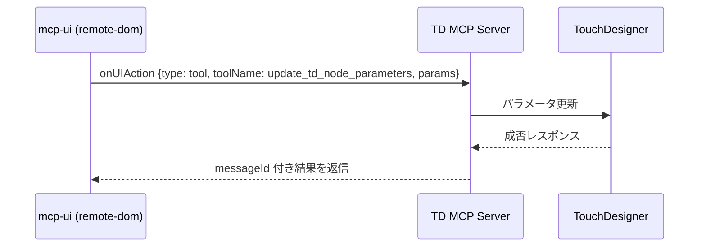

TouchDesigner MCP × mcp-ui 設計メモ
==================================

目的とスコープ
--------------

- TouchDesigner MCP サーバーから mcp-ui の UIResource を返し、TD ノード操作を対話的に行えるダッシュボードを提供する。
- **最小スコープ（先行実装）**: 「ノードブラウザ＋パラメータ編集」を優先し、`get_td_nodes` / `get_td_node_parameters` でツリーと現在値を表示し、`update_td_node_parameters` を `onUIAction.type: 'tool'` で呼ぶスライダーやトグルを配置する。
- 次段階で「パラメータ編集＋プレビュー」「エラーモニタ」「ノード作成ウィザード」を追加する。

参考リソース
------------

- mcp-ui 公式ドキュメント: <https://github.com/MCP-UI-Org/mcp-ui/tree/main/docs>
- 実装例: <https://github.com/MCP-UI-Org/mcp-ui/tree/main/examples> / ./mcp_ui_example.md
- TypeScript SDK: <https://github.com/MCP-UI-Org/mcp-ui/tree/main/sdks/typescript>

想定ユースケース
----------------

- ノードブラウザ＋パラメータ編集: ノードツリー表示、選択ノードのパラメータ取得・更新。
- プリセット生成（作成・接続）: UI で入力した名前やタイプからノード作成、接続メソッド呼び出し。
- エラーモニタ: `get_td_node_errors` を一定間隔で呼び、該当ノードをハイライトしてジャンプ。
- Python スクリプト実行: テキスト入力から `execute_python_script` を呼び、結果を表示。
- プレビュー埋め込み: TD WebServer DAT (デフォルト <http://127.0.0.1:9981>) を iframe で表示。

UI リソースの方針
-----------------

- 1 つの UIResource (`uri: ui://td/dashboard`) を返すツールを追加し、client 側でキャッシュ可能にする。
- `mimeType: application/vnd.mcp-ui.remote-dom` を基本とし、軽量なコンポーネント構成でイベント駆動にする。必要に応じて `text/html` で iframe を併用。
- onUIAction で `type: 'tool'` を用い、既存ツール (`get_td_nodes`, `get_td_node_parameters`, `update_td_node_parameters`, `create_td_node`, `exec_node_method`, `get_td_node_errors`, `execute_python_script`) を叩く。
- UI から渡す payload には messageId を付与し、非同期レスポンスを iframe に返す形を優先。

主要コンポーネント案（remote-dom）
----------------------------------

- `NodeTree`: ノード一覧を表示し、選択イベントを発火。
- `ParamPanel`: 選択ノードのパラメータ取得・編集（スライダー、トグル、テキスト）。変更時に `update_td_node_parameters` を呼ぶ。
- `PresetCreator`: ノード名・タイプ指定で `create_td_node`、必要なら `exec_node_method` で接続。
- `ErrorList`: `get_td_node_errors` の結果表示、ノードジャンプボタン。
- `PythonConsole`: スクリプト入力 + 実行ボタンで `execute_python_script`。ログ領域に結果表示。
- `PreviewFrame`: `text/uri-list` のサブリソースで WebServer DAT の URL を iframe 表示（CORS 設定要確認）。

データフロー（例: パラメータ更新）
----------------------------------

サブリソース構成例
------------------

- メイン: `ui://td/dashboard` (`application/vnd.mcp-ui.remote-dom`)
- プレビュー: `ui://td/preview` (`text/uri-list`, 例: `http://127.0.0.1:9981`) をメインから読み込む

実装手順案
----------

1. 依存追加: `@mcp-ui/server` をサーバーに導入（package.json に追記、ビルド配慮）。
2. UI ツール追加: 例 `ui:td-dashboard` を server の tools に追加し、UIResource を返すロジックを実装。
3. UI 定義: remote-dom のコンポーネントツリーを構築（最初は ParamPanel + NodeTree + PythonConsole の最小セット）。
4. プレビュー連携: WebServer DAT の URL を設定可能にし、CORS/iframe 許可を確認。
5. エラーポーリング: `get_td_node_errors` を一定周期で呼ぶか、ボタン手動実行にするオプションを用意。
6. ステート管理: 選択ノード・パラメータ・実行ログを iframe 内 state で保持。messageId で非同期結果を紐付け。
7. テスト: Vitest で UIResource 生成のスナップショット + onUIAction 経路のパラメータ検証を追加。

留意点
------

- 互換性: 既存ツール名・引数を変えず、UI 側で適合させる。URI は固定でキャッシュを効かせる。
- セキュリティ: iframe は `sandbox` で閉じる。外部 URL は許可リストで制御。スクリプト実行結果はログにのみ表示。
- パフォーマンス: エラーポーリング間隔は可変にし、TD 側負荷を避ける。必要ならデバウンス付き更新。

追加で決めたい項目
------------------

- WebServer DAT の公開 URL と CORS 設定
- プリセット作成で提供するノードタイプ/テンプレートのリスト
- 初期ロード時に取得するノード範囲（ルート限定か、深さ制限か）
