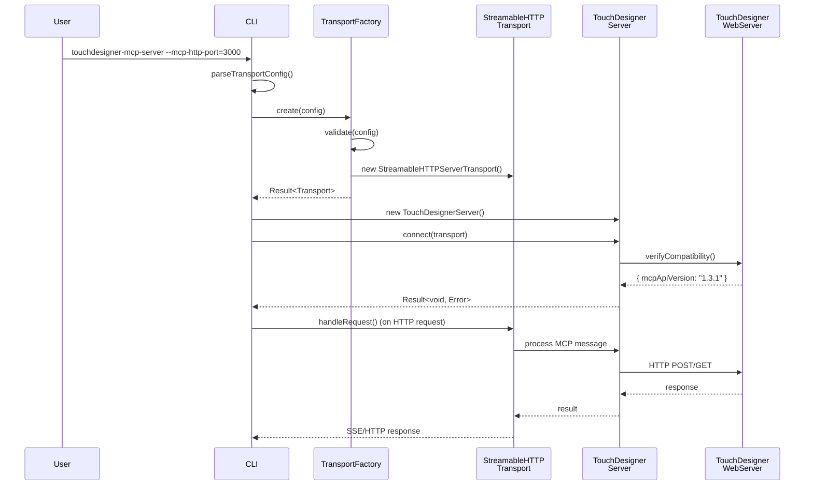

# Streamable HTTP Transport Implementation Plan (Clean Architecture)

**Status**: Approved for Implementation
**Approach**: Clean Architecture (Maximum Extensibility)
**Last Updated**: 2025-12-06

## Table of Contents

1. [Overview](#overview)
2. [Architecture Decision](#architecture-decision)
3. [Current State Analysis](#current-state-analysis)
4. [Architecture Design](#architecture-design)
5. [Implementation Plan](#implementation-plan)
6. [Testing Strategy](#testing-strategy)
7. [Documentation](#documentation)
8. [Technical Considerations](#technical-considerations)
9. [Implementation Checklist](#implementation-checklist)
10. [Success Criteria](#success-criteria)

---

## Overview

This document outlines the **Clean Architecture** implementation plan for adding Streamable HTTP transport support to the TouchDesigner MCP Server. This approach prioritizes long-term maintainability, testability, and extensibility over initial implementation speed.

### Key Features

- ✅ Full separation of concerns (Transport/Server/Config layers)
- ✅ Interface-driven design for maximum testability
- ✅ Easy extension for future transports (WebSocket, gRPC)
- ✅ Production-ready with comprehensive error handling
- ✅ MCP Specification (2025-03-26) compliant

### MCP Specification Reference

<https://modelcontextprotocol.io/specification/2025-03-26/basic/transports>

---

## Architecture Decision

### Why Clean Architecture?

After evaluating three architectural approaches:

1. **Minimal Changes** (~278 LOC, 1-2 days)
2. **Pragmatic Balance** (~330 LOC, 3-5 days)
3. **Clean Architecture** (~600+ LOC, 10-15 days) ⭐ **SELECTED**

**Decision Rationale**:

- Anticipates future transport additions (WebSocket, gRPC)
- Maximizes long-term maintainability and code quality
- Provides clear migration path for evolving requirements
- Aligns with project's commitment to high-quality architecture

### User Requirements Confirmation

The following design decisions were confirmed:

1. **HTTP Bind Address**: CLI-configurable (`--mcp-http-host`, default: `127.0.0.1`)
2. **Default Port Behavior**: Fallback to stdio mode if `--mcp-http-port` not specified
3. **Session Management**: Simple Map-based storage (in-memory)
4. **Error Log Level**: `error` level for all errors (maximum visibility)
5. **Environment Variables**: Maintain existing `TD_WEB_SERVER_HOST/PORT` pattern
6. **Graceful Shutdown**: Full implementation with transport cleanup
7. **Development Tools**: `npm run dev:http` script for easy testing
8. **Type Safety**: Zod runtime validation for all configuration

---

## Current State Analysis

### Existing Implementation

**Transport Layer**: [src/cli.ts:3](../src/cli.ts#L3)

- Currently uses `StdioServerTransport` only
- Mode detection at [src/cli.ts:52-56](../src/cli.ts#L52-L56) rejects non-stdio requests

**Server Architecture**: [src/server/touchDesignerServer.ts:50](../src/server/touchDesignerServer.ts#L50)

- Already designed with `Transport` interface abstraction
- Transport-agnostic `ConnectionManager` at [src/server/connectionManager.ts:10-79](../src/server/connectionManager.ts#L10-L79)

### Dependencies

**Current MCP SDK**: `@modelcontextprotocol/sdk@^1.24.3` ([package.json:29](../package.json#L29))

**No Additional Dependencies Required**:

- ❌ Express: Not needed (using Node.js `http` module + SDK's `StreamableHTTPServerTransport`)
- ❌ CORS library: Not needed (manual CORS headers)
- ✅ All required functionality provided by MCP SDK

### Existing Patterns to Follow

**Result Pattern**: [src/core/result.ts:5-7](../src/core/result.ts#L5-L7)

```typescript
type Result<T, E = Error> =
  | { success: true; data: T }
  | { success: false; error: E };
```

**Logger Pattern**: [src/core/logger.ts](../src/core/logger.ts)

```typescript
interface ILogger {
  sendLog(params: { level: string; data: string; logger: string }): void;
}
```

**Zod Validation Pattern**: Used throughout `src/features/tools/types.ts`

---

## Architecture Design

### High-Level Architecture Diagram

```
┌─────────────────────────────────────────────────────────────────┐
│                         Entry Points                             │
├─────────────────────────────────────────────────────────────────┤
│  cli.ts                                                          │
│    ├─ parseArgs() + parseTransportConfig()                      │
│    ├─ TransportFactory.create(config)                           │
│    └─ startServer(transport, tdConfig)                          │
└─────────────────────────────────────────────────────────────────┘
                              ↓
┌─────────────────────────────────────────────────────────────────┐
│                    Transport Layer (New)                         │
├─────────────────────────────────────────────────────────────────┤
│  TransportFactory                                                │
│    ├─ create(config: TransportConfig): Result<Transport>        │
│    └─ validate(config: TransportConfig): Result<void>           │
│                                                                  │
│  TransportConfig (Union Type)                                   │
│    ├─ StdioTransportConfig                                      │
│    └─ StreamableHttpTransportConfig                             │
│         ├─ port: number                                         │
│         ├─ host: string                                         │
│         ├─ sessionConfig?: SessionConfig                        │
│         └─ securityConfig?: SecurityConfig                      │
│                                                                  │
│  HttpServerManager                                               │
│    ├─ start(config): Result<HttpServer>                         │
│    ├─ stop(): Result<void>                                      │
│    ├─ registerEndpoints(endpoints)                              │
│    └─ getStatus(): ServerStatus                                 │
│                                                                  │
│  SessionManager                                                  │
│    ├─ create(): SessionId                                       │
│    ├─ validate(sessionId): Result<Session>                      │
│    ├─ cleanup(sessionId): Result<void>                          │
│    └─ list(): Session[]                                         │
└─────────────────────────────────────────────────────────────────┘
                              ↓
┌─────────────────────────────────────────────────────────────────┐
│                    Server Core (Enhanced)                        │
├─────────────────────────────────────────────────────────────────┤
│  TouchDesignerServer                                             │
│    ├─ connect(transport: Transport): Result<void>               │
│    ├─ disconnect(): Result<void>                                │
│    └─ getTransportInfo(): TransportInfo (NEW)                   │
│                                                                  │
│  ConnectionManager (Enhanced)                                    │
│    ├─ connect(transport: Transport): Result<void>               │
│    ├─ disconnect(): Result<void>                                │
│    ├─ getTransportType(): TransportType (NEW)                   │
│    └─ getConnectionMetadata(): ConnectionMetadata (NEW)         │
└─────────────────────────────────────────────────────────────────┘
                              ↓
┌─────────────────────────────────────────────────────────────────┐
│                      Config & Validation                         │
├─────────────────────────────────────────────────────────────────┤
│  ConfigValidator                                                 │
│    ├─ validateTransport(config): Result<void>                   │
│    ├─ validateSecurity(config): Result<void>                    │
│    └─ validateSession(config): Result<void>                     │
│                                                                  │
│  SecurityPolicy                                                  │
│    ├─ validateOrigin(origin: string): boolean                   │
│    ├─ validateSession(sessionId: string): boolean               │
│    └─ applyHeaders(response: Response): Response                │
└─────────────────────────────────────────────────────────────────┘
```

### Data Flow



---

## Implementation Plan

### Phase 1: 基盤整備 (Foundation Setup)

**Duration**: 1-2 days
**Priority**: 🔴 High

#### Files to Create

**1. `src/transport/config.ts`**

- Transport configuration type definitions
- Zod schemas for validation
- Default configuration values

```typescript
export type TransportType = 'stdio' | 'streamable-http';

export interface StdioTransportConfig {
  type: 'stdio';
}

export interface StreamableHttpTransportConfig {
  type: 'streamable-http';
  port: number;
  host: string;
  endpoint: string;
  sessionConfig?: SessionConfig;
  securityConfig?: SecurityConfig;
}

export interface SessionConfig {
  enabled: boolean;
  ttl?: number; // milliseconds
}

export interface SecurityConfig {
  allowedOrigins?: string[];
  requireHttps?: boolean;
}

export type TransportConfig =
  | StdioTransportConfig
  | StreamableHttpTransportConfig;

// Zod schemas
export const streamableHttpConfigSchema = z.object({
  type: z.literal('streamable-http'),
  port: z.number().int().min(1).max(65535),
  host: z.string().ip().or(z.literal('0.0.0.0')),
  endpoint: z.string().startsWith('/'),
  // ... additional validation
});
```

**2. `src/transport/validator.ts`**

- Configuration validation logic
- Port range validation
- Security policy validation

```typescript
export class TransportConfigValidator implements IConfigValidator<TransportConfig> {
  validate(config: TransportConfig): Result<void, Error> {
    // Type-specific validation
  }
}
```

**3. `src/transport/index.ts`**

- Public API exports for transport layer

#### Checklist

- [ ] Create type definitions in `config.ts`
- [ ] Implement Zod schemas for all config types
- [ ] Create `TransportConfigValidator` class
- [ ] Write unit tests for validation logic
- [ ] Document all configuration options

---

### Phase 2: Transport Factory

**Duration**: 1 day
**Priority**: 🔴 High

#### Files to Create

**4. `src/transport/factory.ts`**

- Transport instance creation
- Transport type detection
- Configuration validation

```typescript
export class TransportFactory {
  static create(config: TransportConfig): Result<Transport, Error> {
    // Validate first
    const validationResult = TransportConfigValidator.validate(config);
    if (!validationResult.success) {
      return validationResult;
    }

    // Create appropriate transport
    switch (config.type) {
      case 'stdio':
        return this.createStdio();
      case 'streamable-http':
        return this.createStreamableHttp(config);
    }
  }

  private static createStdio(): Result<Transport, Error> {
    const transport = new StdioServerTransport();
    return createSuccessResult(transport);
  }

  private static createStreamableHttp(
    config: StreamableHttpTransportConfig
  ): Result<Transport, Error> {
    try {
      const transport = new StreamableHTTPServerTransport({
        sessionIdGenerator: config.sessionConfig?.enabled
          ? () => randomUUID()
          : undefined,
        // ... additional options
      });
      return createSuccessResult(transport);
    } catch (error) {
      return createErrorResult(new Error(`Failed to create HTTP transport: ${error}`));
    }
  }
}
```

#### Checklist

- [ ] Implement `TransportFactory` class
- [ ] Add `createStdio()` method
- [ ] Add `createStreamableHttp()` method
- [ ] Integrate with validation layer
- [ ] Write unit tests for factory
- [ ] Test error handling paths

---

### Phase 3: HTTP Server Management

**Duration**: 2-3 days
**Priority**: 🔴 High

#### Files to Create

**5. `src/transport/httpServerManager.ts`**

- HTTP server lifecycle management
- Endpoint registration
- Server status monitoring

```typescript
export interface ServerStatus {
  running: boolean;
  port?: number;
  host?: string;
  uptime?: number;
  activeConnections?: number;
}

export class HttpServerManager implements IServerLifecycle {
  private server: http.Server | null = null;
  private startedAt: number | null = null;
  private config: StreamableHttpTransportConfig;

  constructor(config: StreamableHttpTransportConfig) {
    this.config = config;
  }

  start(): Result<http.Server, Error> {
    if (this.isRunning()) {
      return createErrorResult(new Error('Server already running'));
    }

    try {
      this.server = http.createServer(this.handleRequest.bind(this));
      this.server.listen(this.config.port, this.config.host);
      this.startedAt = Date.now();
      return createSuccessResult(this.server);
    } catch (error) {
      return createErrorResult(error as Error);
    }
  }

  stop(): Result<void, Error> {
    if (!this.isRunning()) {
      return createErrorResult(new Error('Server not running'));
    }

    return new Promise((resolve) => {
      this.server!.close((err) => {
        this.server = null;
        this.startedAt = null;
        resolve(err ? createErrorResult(err) : createSuccessResult(undefined));
      });
    });
  }

  registerEndpoints(handlers: EndpointHandlers): void {
    // Register POST, GET, DELETE handlers
  }

  getStatus(): ServerStatus {
    return {
      running: this.isRunning(),
      port: this.server?.address()?.port,
      host: this.config.host,
      uptime: this.startedAt ? Date.now() - this.startedAt : undefined,
    };
  }

  isRunning(): boolean {
    return this.server !== null;
  }

  private handleRequest(req: IncomingMessage, res: ServerResponse): void {
    // Route to appropriate handler based on method and path
  }
}
```

#### Checklist

- [ ] Implement `HttpServerManager` class
- [ ] Add lifecycle methods (`start`, `stop`)
- [ ] Implement endpoint registration
- [ ] Add status monitoring
- [ ] Write unit tests
- [ ] Test port conflicts and error cases

---

### Phase 4: Session Management

**Duration**: 1-2 days
**Priority**: 🟡 Medium

#### Files to Create

**6. `src/transport/sessionManager.ts`**

- Session creation and validation
- TTL-based cleanup
- Session metadata management

```typescript
export interface Session {
  id: string;
  createdAt: number;
  lastAccessedAt: number;
  metadata?: Record<string, unknown>;
}

export class SessionManager implements ISessionManager {
  private sessions: Map<string, Session> = new Map();
  private readonly config: SessionConfig;
  private readonly logger: ILogger;
  private cleanupInterval: NodeJS.Timeout | null = null;

  constructor(config: SessionConfig, logger: ILogger) {
    this.config = config;
    this.logger = logger;
  }

  create(metadata?: Record<string, unknown>): string {
    const sessionId = randomUUID();
    const session: Session = {
      id: sessionId,
      createdAt: Date.now(),
      lastAccessedAt: Date.now(),
      metadata,
    };
    this.sessions.set(sessionId, session);

    this.logger.sendLog({
      level: 'info',
      logger: 'SessionManager',
      data: `Session created: ${sessionId}`,
    });

    return sessionId;
  }

  validate(sessionId: string): Result<Session, Error> {
    const session = this.sessions.get(sessionId);
    if (!session) {
      return createErrorResult(new Error(`Invalid session ID: ${sessionId}`));
    }

    // Check TTL if configured
    if (this.config.ttl) {
      const elapsed = Date.now() - session.lastAccessedAt;
      if (elapsed > this.config.ttl) {
        this.cleanup(sessionId);
        return createErrorResult(new Error(`Session expired: ${sessionId}`));
      }
    }

    // Update last accessed time
    session.lastAccessedAt = Date.now();
    return createSuccessResult(session);
  }

  cleanup(sessionId: string): Result<void, Error> {
    const existed = this.sessions.delete(sessionId);
    if (existed) {
      this.logger.sendLog({
        level: 'info',
        logger: 'SessionManager',
        data: `Session cleaned up: ${sessionId}`,
      });
      return createSuccessResult(undefined);
    }
    return createErrorResult(new Error(`Session not found: ${sessionId}`));
  }

  list(): Session[] {
    return Array.from(this.sessions.values());
  }

  startTTLCleanup(): void {
    if (!this.config.ttl || this.cleanupInterval) return;

    this.cleanupInterval = setInterval(() => {
      const now = Date.now();
      for (const [id, session] of this.sessions.entries()) {
        if (now - session.lastAccessedAt > this.config.ttl!) {
          this.cleanup(id);
        }
      }
    }, this.config.ttl / 2); // Cleanup every half TTL period
  }

  stopTTLCleanup(): void {
    if (this.cleanupInterval) {
      clearInterval(this.cleanupInterval);
      this.cleanupInterval = null;
    }
  }
}
```

#### Checklist

- [ ] Implement `SessionManager` class
- [ ] Add session CRUD operations
- [ ] Implement TTL-based expiration
- [ ] Add periodic cleanup task
- [ ] Write unit tests (including TTL tests with fake timers)
- [ ] Test concurrent access scenarios

---

### Phase 5: Security Policy

**Duration**: 1 day
**Priority**: 🟡 Medium

#### Files to Create

**7. `src/transport/security.ts`**

- Origin validation
- CORS header application
- Session header validation

```typescript
export class SecurityPolicy implements ISecurityPolicy {
  private readonly config: SecurityConfig;

  constructor(config: SecurityConfig) {
    this.config = config;
  }

  validateOrigin(origin: string | undefined): boolean {
    if (!this.config.allowedOrigins || this.config.allowedOrigins.length === 0) {
      return true; // No restriction
    }

    if (!origin) {
      return false; // Origin required when restriction enabled
    }

    return this.config.allowedOrigins.some(allowed => {
      // Support wildcards like "http://localhost:*"
      return origin.startsWith(allowed.replace('*', ''));
    });
  }

  validateSessionHeader(sessionId: string | undefined): boolean {
    if (!sessionId) return false;

    // UUID format validation
    const uuidRegex = /^[0-9a-f]{8}-[0-9a-f]{4}-[0-9a-f]{4}-[0-9a-f]{4}-[0-9a-f]{12}$/i;
    return uuidRegex.test(sessionId);
  }

  applySecurityHeaders(headers: Record<string, string>): Record<string, string> {
    return {
      ...headers,
      'X-Content-Type-Options': 'nosniff',
      'X-Frame-Options': 'DENY',
      'X-XSS-Protection': '1; mode=block',
      ...(this.config.requireHttps && {
        'Strict-Transport-Security': 'max-age=31536000; includeSubDomains',
      }),
    };
  }
}
```

#### Checklist

- [ ] Implement `SecurityPolicy` class
- [ ] Add origin validation with wildcard support
- [ ] Implement session header validation
- [ ] Add security header application
- [ ] Write unit tests for all validation scenarios
- [ ] Document security best practices

---

### Phase 6: Streamable HTTP Transport Integration

**Duration**: 2-3 days
**Priority**: 🔴 High

#### Tasks

1. **Integrate `StreamableHTTPServerTransport` with `TransportFactory`**
   - Configure session callbacks
   - Set up event store (if needed for resumability)
   - Configure retry intervals

2. **Connect HTTP Server Manager with Transport**
   - Route `/mcp` endpoint to `transport.handleRequest()`
   - Add `/health` endpoint for monitoring
   - Implement graceful shutdown

3. **Session-Transport Coordination**
   - Create session on `onsessioninitialized` callback
   - Clean up session on `onsessionclosed` callback
   - Validate session before processing requests

4. **Error Handling**
   - Map HTTP errors to MCP JSON-RPC errors
   - Log all errors at `error` level
   - Return appropriate HTTP status codes

#### Checklist

- [ ] Update `TransportFactory.createStreamableHttp()`
- [ ] Integrate `SessionManager` with transport callbacks
- [ ] Implement endpoint routing in `HttpServerManager`
- [ ] Add `/health` endpoint
- [ ] Implement graceful shutdown with signal handling
- [ ] Write integration tests
- [ ] Test with real MCP client

---

### Phase 7: CLI & Server Core Integration

**Duration**: 1-2 days
**Priority**: 🔴 High

#### Files to Modify

**8. `src/cli.ts`** (Modifications)

```typescript
import { TransportFactory } from './transport/factory.js';
import type { TransportConfig } from './transport/config.js';

// Add new function
export function parseTransportConfig(args: string[]): TransportConfig {
  // Detect if HTTP mode requested
  const httpPortArg = args.find(arg => arg.startsWith('--mcp-http-port='));

  if (httpPortArg) {
    const port = parseInt(httpPortArg.split('=')[1], 10);
    const hostArg = args.find(arg => arg.startsWith('--mcp-http-host='));
    const host = hostArg ? hostArg.split('=')[1] : '127.0.0.1';

    return {
      type: 'streamable-http',
      port,
      host,
      endpoint: '/mcp',
      sessionConfig: { enabled: true },
    };
  }

  // Default to stdio
  return { type: 'stdio' };
}

// Modify startServer
export async function startServer(params?: {
  nodeEnv?: string;
  argv?: string[];
}): Promise<void> {
  try {
    // Parse transport configuration
    const transportConfig = parseTransportConfig(params?.argv || []);

    // Create transport via factory
    const transportResult = TransportFactory.create(transportConfig);
    if (!transportResult.success) {
      throw transportResult.error;
    }
    const transport = transportResult.data;

    // Parse TouchDesigner connection args
    const args = parseArgs(params?.argv);
    process.env.TD_WEB_SERVER_HOST = args.host;
    process.env.TD_WEB_SERVER_PORT = args.port.toString();

    // Create and connect server
    const server = new TouchDesignerServer();
    const result = await server.connect(transport);

    if (!result.success) {
      throw new Error(`Failed to connect: ${result.error.message}`);
    }

    // Keep process alive for HTTP mode
    if (transportConfig.type === 'streamable-http') {
      // HTTP server keeps process alive automatically
      console.log(`Server running in HTTP mode on ${transportConfig.host}:${transportConfig.port}`);
    }
  } catch (error) {
    const errorMessage = error instanceof Error ? error.message : String(error);
    throw new Error(`Failed to initialize server: ${errorMessage}`);
  }
}
```

**9. `src/server/touchDesignerServer.ts`** (Enhancements)

```typescript
// Add new method
export interface TransportInfo {
  type: TransportType;
  status: 'connected' | 'disconnected';
  metadata?: Record<string, unknown>;
}

export class TouchDesignerServer {
  // ... existing code ...

  getTransportInfo(): TransportInfo {
    const transportType = this.connectionManager.getTransportType();
    const isConnected = this.connectionManager.isConnected();

    return {
      type: transportType || 'stdio',
      status: isConnected ? 'connected' : 'disconnected',
      metadata: this.connectionManager.getConnectionMetadata(),
    };
  }
}
```

**10. `src/server/connectionManager.ts`** (Enhancements)

```typescript
export interface ConnectionMetadata {
  transportType: TransportType;
  connectedAt?: number;
  sessionId?: string;
}

export class ConnectionManager {
  private transport: Transport | null = null;
  private connectedAt: number | null = null;

  // ... existing code ...

  getTransportType(): TransportType | null {
    if (!this.transport) return null;

    // Detect transport type
    if (this.transport.constructor.name === 'StdioServerTransport') {
      return 'stdio';
    }
    if (this.transport.constructor.name === 'StreamableHTTPServerTransport') {
      return 'streamable-http';
    }
    return null;
  }

  getConnectionMetadata(): ConnectionMetadata {
    return {
      transportType: this.getTransportType() || 'stdio',
      connectedAt: this.connectedAt,
      sessionId: (this.transport as any)?.sessionId,
    };
  }

  async connect(transport: Transport): Promise<Result<void, Error>> {
    // ... existing validation ...

    this.transport = transport;
    this.connectedAt = Date.now();

    try {
      await this.server.connect(transport);

      // Enhanced logging with transport type
      this.logger.sendLog({
        data: `Server connected [${this.getTransportType()}] and ready to process requests: ${process.env.TD_WEB_SERVER_HOST}:${process.env.TD_WEB_SERVER_PORT}`,
        level: "info",
        logger: "ConnectionManager",
      });

      return createSuccessResult(undefined);
    } catch (error) {
      this.transport = null;
      this.connectedAt = null;
      const err = error instanceof Error ? error : new Error(String(error));
      console.error(
        "Fatal error starting server! Check TouchDesigner setup and starting webserver. For detailed setup instructions, see https://github.com/8beeeaaat/touchdesigner-mcp",
        err,
      );
      return createErrorResult(err);
    }
  }
}
```

**11. `src/index.ts`** (Exports)

```typescript
// Add new exports
export type {
  TransportConfig,
  StreamableHttpTransportConfig,
  StdioTransportConfig,
  TransportType,
} from './transport/config.js';

export { TransportFactory } from './transport/factory.js';
export { SessionManager } from './transport/sessionManager.js';
export { HttpServerManager } from './transport/httpServerManager.js';
export { SecurityPolicy } from './transport/security.js';
```

#### Checklist

- [ ] Modify `cli.ts` with transport config parsing
- [ ] Enhance `TouchDesignerServer` with transport info
- [ ] Enhance `ConnectionManager` with metadata
- [ ] Update `index.ts` exports
- [ ] Write unit tests for CLI parsing
- [ ] Write unit tests for enhanced server methods
- [ ] Test integration end-to-end

---

### Phase 8: Documentation & Final Testing

**Duration**: 1 day
**Priority**: 🟡 Medium

#### Files to Create/Update

**12. `docs/architecture/transport-layer.md`**

- Architecture documentation
- Component interaction diagrams
- Extension guide for new transports

**13. Update `README.md`**

```markdown
### HTTP Transport Mode

TouchDesigner MCP Server supports HTTP transport for remote clients:

```bash
# Start in HTTP mode
touchdesigner-mcp-server \
  --mcp-http-port=3000 \
  --mcp-http-host=127.0.0.1 \
  --host=http://127.0.0.1 \
  --port=9981
```

**Configuration Options**:

- `--mcp-http-port`: HTTP server port (required for HTTP mode)
- `--mcp-http-host`: Bind address (default: 127.0.0.1)
- `--host`: TouchDesigner WebServer host
- `--port`: TouchDesigner WebServer port (default: 9981)

**Health Check Endpoint**:

```bash
curl http://localhost:3000/health
```

```

**14. Update `README.ja.md`** (Japanese version)

**15. Update `CLAUDE.md`**
```markdown
## Development Commands

### HTTP Transport Mode
- `npm run dev:http` - Start MCP server in HTTP mode with inspector
- `npm run test:http` - Run HTTP transport integration tests

### Architecture
The server now supports multiple transports through a factory pattern:
- `src/transport/factory.ts` - Transport creation and validation
- `src/transport/httpServerManager.ts` - HTTP server lifecycle
- `src/transport/sessionManager.ts` - Session management

See `docs/architecture/transport-layer.md` for detailed architecture.
```

**16. `package.json` Scripts**

```json
{
  "scripts": {
    "dev:http": "npm run build && node dist/cli.js --mcp-http-port=3000 --mcp-http-host=127.0.0.1",
    "test:http": "vitest run tests/integration/httpTransport.test.ts"
  }
}
```

#### Checklist

- [ ] Create architecture documentation
- [ ] Update README.md with HTTP mode instructions
- [ ] Update README.ja.md (Japanese translation)
- [ ] Update CLAUDE.md with new development commands
- [ ] Add JSDoc comments to all public APIs
- [ ] Create migration guide from stdio to HTTP
- [ ] Run full test suite (unit + integration)
- [ ] Test with MCP Inspector
- [ ] Verify no regressions in stdio mode

---

## Testing Strategy

### Unit Tests

**Coverage Target**: >90% for new code

#### Transport Layer Tests

**`tests/unit/transport/factory.test.ts`**

```typescript
describe('TransportFactory', () => {
  it('should create stdio transport', () => {
    const config: TransportConfig = { type: 'stdio' };
    const result = TransportFactory.create(config);
    expect(result.success).toBe(true);
  });

  it('should create HTTP transport with valid config', () => {
    const config: StreamableHttpTransportConfig = {
      type: 'streamable-http',
      port: 3000,
      host: '127.0.0.1',
      endpoint: '/mcp',
      sessionConfig: { enabled: true },
    };
    const result = TransportFactory.create(config);
    expect(result.success).toBe(true);
  });

  it('should reject invalid port', () => {
    const config = { type: 'streamable-http', port: 70000, host: '127.0.0.1' };
    const result = TransportFactory.create(config);
    expect(result.success).toBe(false);
  });
});
```

**`tests/unit/transport/sessionManager.test.ts`**

```typescript
describe('SessionManager', () => {
  it('should create session with UUID', () => {
    const manager = new SessionManager({ enabled: true }, mockLogger);
    const sessionId = manager.create();
    expect(sessionId).toMatch(/^[0-9a-f-]{36}$/);
  });

  it('should validate existing session', () => {
    const manager = new SessionManager({ enabled: true }, mockLogger);
    const sessionId = manager.create();
    const result = manager.validate(sessionId);
    expect(result.success).toBe(true);
  });

  it('should reject invalid session ID', () => {
    const manager = new SessionManager({ enabled: true }, mockLogger);
    const result = manager.validate('invalid-id');
    expect(result.success).toBe(false);
  });

  it('should expire sessions based on TTL', async () => {
    vi.useFakeTimers();
    const manager = new SessionManager({ enabled: true, ttl: 1000 }, mockLogger);
    const sessionId = manager.create();

    vi.advanceTimersByTime(1001);
    const result = manager.validate(sessionId);
    expect(result.success).toBe(false);

    vi.useRealTimers();
  });
});
```

**`tests/unit/transport/httpServerManager.test.ts`**

```typescript
describe('HttpServerManager', () => {
  it('should start HTTP server', async () => {
    const config = { type: 'streamable-http', port: 3001, host: '127.0.0.1', endpoint: '/mcp' };
    const manager = new HttpServerManager(config);

    const result = manager.start();
    expect(result.success).toBe(true);
    expect(manager.isRunning()).toBe(true);

    await manager.stop();
  });

  it('should report server status', () => {
    const manager = new HttpServerManager(config);
    manager.start();

    const status = manager.getStatus();
    expect(status.running).toBe(true);
    expect(status.port).toBe(3001);
  });
});
```

**`tests/unit/transport/security.test.ts`**

```typescript
describe('SecurityPolicy', () => {
  it('should validate allowed origins', () => {
    const policy = new SecurityPolicy({ allowedOrigins: ['http://localhost:*'] });
    expect(policy.validateOrigin('http://localhost:3000')).toBe(true);
    expect(policy.validateOrigin('http://example.com')).toBe(false);
  });

  it('should apply security headers', () => {
    const policy = new SecurityPolicy({ requireHttps: true });
    const headers = policy.applySecurityHeaders({});
    expect(headers['X-Content-Type-Options']).toBe('nosniff');
    expect(headers['Strict-Transport-Security']).toBeDefined();
  });
});
```

#### CLI Tests

**`tests/unit/cli.test.ts`** (Enhanced)

```typescript
describe('CLI - Transport Config Parsing', () => {
  it('should parse HTTP transport config', () => {
    const config = parseTransportConfig(['--mcp-http-port=3000', '--mcp-http-host=0.0.0.0']);
    expect(config.type).toBe('streamable-http');
    expect(config.port).toBe(3000);
    expect(config.host).toBe('0.0.0.0');
  });

  it('should default to stdio mode', () => {
    const config = parseTransportConfig([]);
    expect(config.type).toBe('stdio');
  });
});
```

### Integration Tests

**`tests/integration/httpTransport.test.ts`**

```typescript
describe('HTTP Transport Integration', () => {
  let server: TouchDesignerServer;
  let httpServer: HttpServerManager;

  beforeAll(async () => {
    process.env.TD_WEB_SERVER_HOST = 'http://127.0.0.1';
    process.env.TD_WEB_SERVER_PORT = '9981';

    const config: StreamableHttpTransportConfig = {
      type: 'streamable-http',
      port: 3002,
      host: '127.0.0.1',
      endpoint: '/mcp',
      sessionConfig: { enabled: true },
    };

    const transportResult = TransportFactory.create(config);
    expect(transportResult.success).toBe(true);

    server = new TouchDesignerServer();
    await server.connect(transportResult.data);
  });

  afterAll(async () => {
    await server.disconnect();
  });

  it('should handle initialization request', async () => {
    const response = await fetch('http://127.0.0.1:3002/mcp', {
      method: 'POST',
      headers: { 'Content-Type': 'application/json' },
      body: JSON.stringify({
        jsonrpc: '2.0',
        method: 'initialize',
        params: { protocolVersion: '2024-11-05', capabilities: {} },
        id: 1,
      }),
    });

    expect(response.status).toBe(200);
    const sessionId = response.headers.get('mcp-session-id');
    expect(sessionId).toBeDefined();
  });

  it('should handle tools/list request', async () => {
    // First initialize
    const initResponse = await fetch('http://127.0.0.1:3002/mcp', {
      method: 'POST',
      body: JSON.stringify({ jsonrpc: '2.0', method: 'initialize', params: {}, id: 1 }),
    });
    const sessionId = initResponse.headers.get('mcp-session-id');

    // Then call tools/list
    const response = await fetch('http://127.0.0.1:3002/mcp', {
      method: 'POST',
      headers: {
        'Content-Type': 'application/json',
        'Mcp-Session-Id': sessionId!,
      },
      body: JSON.stringify({
        jsonrpc: '2.0',
        method: 'tools/list',
        id: 2,
      }),
    });

    expect(response.status).toBe(200);
    const data = await response.json();
    expect(data.result.tools).toBeInstanceOf(Array);
  });

  it('should reject request without session ID', async () => {
    const response = await fetch('http://127.0.0.1:3002/mcp', {
      method: 'POST',
      headers: { 'Content-Type': 'application/json' },
      body: JSON.stringify({
        jsonrpc: '2.0',
        method: 'tools/list',
        id: 1,
      }),
    });

    expect(response.status).toBe(400);
  });

  it('should handle health check', async () => {
    const response = await fetch('http://127.0.0.1:3002/health');
    expect(response.status).toBe(200);
    const data = await response.json();
    expect(data.status).toBe('healthy');
  });
});
```

### Manual Testing with MCP Inspector

**Test Script**: `scripts/test-http-manual.sh`

```bash
#!/bin/bash

echo "Starting TouchDesigner MCP Server in HTTP mode..."
npm run dev:http &
SERVER_PID=$!

sleep 2

echo "Testing health endpoint..."
curl http://localhost:3000/health

echo ""
echo "Server running. Use MCP Inspector to test:"
echo "  Connection URL: http://localhost:3000/mcp"
echo ""
echo "Press Ctrl+C to stop server"

wait $SERVER_PID
```

---

## Documentation

### Architecture Documentation

**`docs/architecture/transport-layer.md`**

```markdown
# Transport Layer Architecture

## Overview

The transport layer provides a pluggable architecture for supporting multiple MCP transport protocols.

## Components

### TransportFactory

**Responsibility**: Create transport instances based on configuration

**Interface**:
- `create(config: TransportConfig): Result<Transport, Error>`

**Supported Transports**:
1. **Stdio**: Standard input/output transport (default)
2. **Streamable HTTP**: HTTP-based transport with SSE streaming

### HttpServerManager

**Responsibility**: Manage HTTP server lifecycle

**Features**:
- Server start/stop
- Endpoint registration
- Status monitoring
- Graceful shutdown

### SessionManager

**Responsibility**: Manage client sessions

**Features**:
- Session creation (UUID v4)
- Session validation
- TTL-based expiration
- Automatic cleanup

### SecurityPolicy

**Responsibility**: Apply security policies

**Features**:
- Origin validation
- CORS header application
- Session header validation

## Extension Guide

### Adding a New Transport

1. Define transport config type in `src/transport/config.ts`
2. Add Zod schema for validation
3. Extend `TransportFactory.create()` with new case
4. Implement transport-specific manager (if needed)
5. Update tests and documentation

**Example** (WebSocket):

```typescript
// 1. Define config
export interface WebSocketTransportConfig {
  type: 'websocket';
  port: number;
  path?: string;
}

// 2. Add to union type
export type TransportConfig =
  | StdioTransportConfig
  | StreamableHttpTransportConfig
  | WebSocketTransportConfig;

// 3. Extend factory
static create(config: TransportConfig): Result<Transport, Error> {
  switch (config.type) {
    case 'stdio':
      return this.createStdio();
    case 'streamable-http':
      return this.createStreamableHttp(config);
    case 'websocket':
      return this.createWebSocket(config);
  }
}
```

## Design Principles

1. **Open/Closed Principle**: Open for extension, closed for modification
2. **Dependency Inversion**: High-level modules depend on abstractions
3. **Interface Segregation**: Clients depend only on interfaces they use
4. **Single Responsibility**: Each component has one reason to change

```

---

## Technical Considerations

### 1. Session Management Robustness

**Challenge**: Prevent memory leaks from orphaned sessions

**Solution**:
- TTL-based automatic cleanup
- Periodic cleanup task (runs every TTL/2)
- Graceful shutdown with active session notification

**Implementation**:
```typescript
// Automatic cleanup
sessionManager.startTTLCleanup();

// Graceful shutdown
process.on('SIGINT', async () => {
  sessionManager.stopTTLCleanup();
  for (const session of sessionManager.list()) {
    await sessionManager.cleanup(session.id);
  }
});
```

### 2. Security Hardening

**Requirements**:

- Origin header validation against whitelist
- Localhost-only binding by default
- Security headers on all responses

**Implementation**:

```typescript
const securityPolicy = new SecurityPolicy({
  allowedOrigins: ['http://localhost:*', 'http://127.0.0.1:*'],
  requireHttps: false, // Set true for production
});

// In request handler
if (!securityPolicy.validateOrigin(req.headers.origin)) {
  res.writeHead(403);
  res.end('Forbidden');
  return;
}

const headers = securityPolicy.applySecurityHeaders({
  'Content-Type': 'application/json',
});
```

### 3. Error Handling Strategy

**Error Response Format** (JSON-RPC 2.0):

```json
{
  "jsonrpc": "2.0",
  "error": {
    "code": -32000,
    "message": "Invalid session"
  },
  "id": null
}
```

**HTTP Status Codes**:

- `200 OK`: Successful request
- `202 Accepted`: Notification received
- `400 Bad Request`: Invalid session or malformed request
- `403 Forbidden`: Origin validation failed
- `404 Not Found`: Endpoint not found
- `405 Method Not Allowed`: Unsupported HTTP method
- `500 Internal Server Error`: Server-side errors

**Logging Strategy**:

- All errors logged at `error` level
- Session lifecycle logged at `info` level
- Debug logs available in development mode

### 4. Performance Considerations

**Optimizations**:

1. Use `Map` for session storage (O(1) lookup)
2. Limit maximum concurrent sessions (configurable, default: 100)
3. Connection pooling for TouchDesigner WebServer client (already implemented)
4. Avoid unnecessary session validation on every request

**Monitoring**:

- Track active session count
- Monitor session creation/cleanup rate
- Log slow requests (>1s)

### 5. Compatibility with Existing stdio Mode

**Requirements**:

- Zero breaking changes to existing CLI
- Both transports work independently
- Shared codebase for server logic

**Implementation Strategy**:

- `TransportFactory` handles all transport types
- `TouchDesignerServer` remains transport-agnostic
- CLI detects mode based on arguments

**Verification**:

```bash
# Stdio mode (existing)
touchdesigner-mcp-server --stdio

# HTTP mode (new)
touchdesigner-mcp-server --mcp-http-port=3000
```

---

## Implementation Checklist

### Phase 1: Foundation (1-2 days)

- [ ] Create `src/transport/config.ts` with type definitions
- [ ] Implement Zod schemas for validation
- [ ] Create `src/transport/validator.ts`
- [ ] Create `src/transport/index.ts` exports
- [ ] Write unit tests for validation
- [ ] Document configuration options

### Phase 2: Factory (1 day)

- [ ] Implement `src/transport/factory.ts`
- [ ] Add `createStdio()` method
- [ ] Add `createStreamableHttp()` method
- [ ] Integrate validation
- [ ] Write unit tests for factory
- [ ] Test error handling

### Phase 3: HTTP Server (2-3 days)

- [ ] Implement `src/transport/httpServerManager.ts`
- [ ] Add lifecycle methods
- [ ] Implement endpoint registration
- [ ] Add status monitoring
- [ ] Write unit tests
- [ ] Test port conflicts

### Phase 4: Session Manager (1-2 days)

- [ ] Implement `src/transport/sessionManager.ts`
- [ ] Add CRUD operations
- [ ] Implement TTL expiration
- [ ] Add periodic cleanup
- [ ] Write unit tests with fake timers
- [ ] Test concurrent access

### Phase 5: Security (1 day)

- [ ] Implement `src/transport/security.ts`
- [ ] Add origin validation
- [ ] Implement header validation
- [ ] Add security headers
- [ ] Write unit tests
- [ ] Document security practices

### Phase 6: Integration (2-3 days)

- [ ] Update `TransportFactory`
- [ ] Integrate `SessionManager`
- [ ] Implement endpoint routing
- [ ] Add `/health` endpoint
- [ ] Implement graceful shutdown
- [ ] Write integration tests

### Phase 7: CLI & Server (1-2 days)

- [ ] Modify `cli.ts` with config parsing
- [ ] Enhance `TouchDesignerServer`
- [ ] Enhance `ConnectionManager`
- [ ] Update `index.ts` exports
- [ ] Write CLI tests
- [ ] Test end-to-end

### Phase 8: Documentation (1 day)

- [ ] Create architecture docs
- [ ] Update README.md
- [ ] Update README.ja.md
- [ ] Update CLAUDE.md
- [ ] Add JSDoc comments
- [ ] Create migration guide
- [ ] Test with MCP Inspector

---

## Success Criteria

### Functional Requirements

1. ✅ HTTP transport mode works without breaking stdio mode
2. ✅ Session management is robust (no memory leaks, proper cleanup)
3. ✅ Security requirements met (Origin validation, security headers)
4. ✅ All tests pass (unit + integration, >90% coverage)
5. ✅ Documentation is complete and accurate
6. ✅ No regression in existing functionality

### Non-Functional Requirements

1. ✅ Code follows existing patterns (Result, Logger, Zod)
2. ✅ All public APIs have JSDoc comments
3. ✅ Type safety maintained (no `any` types)
4. ✅ Performance acceptable (<10ms overhead per request)
5. ✅ Extensible for future transports (WebSocket, gRPC)

### Acceptance Testing

- [ ] stdio mode works as before (`touchdesigner-mcp-server --stdio`)
- [ ] HTTP mode starts successfully (`touchdesigner-mcp-server --mcp-http-port=3000`)
- [ ] MCP Inspector connects to HTTP endpoint
- [ ] All MCP tools work in HTTP mode
- [ ] Session cleanup works (no memory leaks after 24h)
- [ ] Graceful shutdown completes in <5s
- [ ] Security validation prevents unauthorized access

---

## Timeline Estimate

| Phase | Duration | Cumulative |
|-------|----------|------------|
| Phase 1: Foundation | 1-2 days | 1-2 days |
| Phase 2: Factory | 1 day | 2-3 days |
| Phase 3: HTTP Server | 2-3 days | 4-6 days |
| Phase 4: Session Manager | 1-2 days | 5-8 days |
| Phase 5: Security | 1 day | 6-9 days |
| Phase 6: Integration | 2-3 days | 8-12 days |
| Phase 7: CLI & Server | 1-2 days | 9-14 days |
| Phase 8: Documentation | 1 day | 10-15 days |

**Total**: 10-15 days

---

## Future Enhancements

### Phase 2 (Future)

1. **WebSocket Transport**
   - Real-time bidirectional communication
   - Lower latency than HTTP
   - Better for long-running operations

2. **Authentication & Authorization**
   - Bearer token authentication
   - API key support
   - Role-based access control (RBAC)

3. **Rate Limiting**
   - Per-session rate limits
   - Global rate limits
   - Configurable thresholds

4. **Metrics & Monitoring**
   - Prometheus metrics export
   - Session lifecycle metrics
   - Request latency histograms

5. **Advanced Session Management**
   - Redis-based session store
   - Session persistence across restarts
   - Multi-server session sharing

---

## References

### MCP Specification

- [MCP Specification - Transports](https://modelcontextprotocol.io/specification/2025-03-26/basic/transports)
- [Streamable HTTP Transport Spec](https://modelcontextprotocol.io/specification/2025-03-26/basic/transports#http-with-sse)

### MCP TypeScript SDK

- [GitHub Repository](https://github.com/modelcontextprotocol/typescript-sdk)
- [Streamable HTTP Examples](https://github.com/modelcontextprotocol/typescript-sdk/tree/main/src/examples/server)
- [SDK Documentation](https://github.com/modelcontextprotocol/typescript-sdk/blob/main/docs/server.md)

### Related Resources

- [Why MCP Deprecated SSE](https://blog.fka.dev/blog/2025-06-06-why-mcp-deprecated-sse-and-go-with-streamable-http/)
- [MCP with Streamable HTTP Tutorial](https://medium.com/@itsuki.enjoy/mcp-server-and-client-with-sse-the-new-streamable-http-d860850d9d9d)
- [Cloudflare MCP Servers](https://blog.cloudflare.com/streamable-http-mcp-servers-python/)

---

## Appendix: Design Decisions Log

### Decision 1: Use Clean Architecture over Minimal Changes

**Date**: 2025-12-06
**Rationale**: Long-term maintainability and extensibility outweigh short-term implementation speed. The project anticipates future transport additions (WebSocket, gRPC), making upfront abstraction investment worthwhile.

### Decision 2: No External HTTP Framework

**Date**: 2025-12-06
**Rationale**: MCP SDK's `StreamableHTTPServerTransport` already handles HTTP protocol details. Adding Express would introduce unnecessary dependency and complexity.

### Decision 3: Zod for Runtime Validation

**Date**: 2025-12-06
**Rationale**: User requirement for maximum type safety. Zod provides both compile-time and runtime validation, catching configuration errors early.

### Decision 4: Map-based Session Storage

**Date**: 2025-12-06
**Rationale**: Sufficient for initial implementation. Redis integration can be added later if multi-server support is needed.

### Decision 5: Error Level Logging

**Date**: 2025-12-06
**Rationale**: User requirement for maximum visibility. All errors (including client errors) logged at `error` level for easy debugging.

---

**Document Version**: 2.0
**Status**: Approved for Implementation
**Next Review**: After Phase 4 completion
