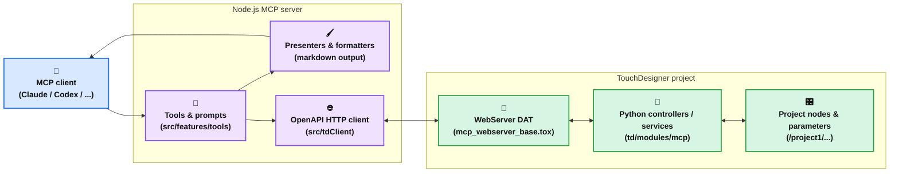

# TouchDesigner MCP

TouchDesignerのためのMCP(Model Context Protocol) サーバー実装です。AIエージェントがTouchDesignerプロジェクトを制御・操作できるようになることを目指しています。

[English](https://github.com/8beeeaaat/touchdesigner-mcp/blob/main/README.md) / [日本語](https://github.com/8beeeaaat/touchdesigner-mcp/blob/main/README.ja.md)

## 概要

[](https://youtu.be/V2znaqGU7f4?si=6HDFbcBHCFPdttkM&t=635)

TouchDesigner MCPは、AIモデルとTouchDesigner WebServer DAT 間のブリッジとして機能し、AIエージェントが以下のことが可能になります

- ノードの作成、変更、削除
- ノードプロパティやプロジェクト構造の照会
- PythonスクリプトによるTouchDesignerのプログラム的制御

## アーキテクチャ



## 利用方法

<details>
  <summary>方法1: Claude Desktop + MCP Bundle（推奨）</summary>

##### 1. ファイルをダウンロード

[リリースページ](https://github.com/8beeeaaat/touchdesigner-mcp/releases/latest)から以下をダウンロード：

- **TouchDesigner Components**: `touchdesigner-mcp-td.zip`
- **[MCP Bundle](https://github.com/modelcontextprotocol/mcpb) (.mcpb)**: `touchdesigner-mcp.mcpb`

##### 2. TouchDesignerコンポーネントを設置

1. `touchdesigner-mcp-td.zip`を展開
2. 展開したフォルダから`mcp_webserver_base.tox`を操作したいTouchDesignerプロジェクト直下にインポート
   例: `/project1/mcp_webserver_base`となるように配置

<https://github.com/user-attachments/assets/215fb343-6ed8-421c-b948-2f45fb819ff4>

  TouchDesignerのメニューからTextportを起動してサーバーの起動ログを確認できます。

  

##### 3. MCP Bundleをインストール

`touchdesigner-mcp.mcpb`ファイルをダブルクリックしてClaude DesktopにMCP Bundleをインストール

<https://github.com/user-attachments/assets/0786d244-8b82-4387-bbe4-9da048212854>

##### 4. MCP Bundleが自動的にTouchDesignerサーバー接続を処理

**⚠️ 重要:** TouchDesignerコンポーネントのディレクトリ構造は展開した状態を正確に保持してください。`mcp_webserver_base.tox`コンポーネントは`modules/`ディレクトリやその他のファイルへの相対パスを参照しています。

</details>

<details>
  <summary>方法2: npxを利用する</summary>

*Node.jsがインストールされていることが前提となります*

##### 1. TouchDesignerコンポーネントを設置

1. [リリースページ](https://github.com/8beeeaaat/touchdesigner-mcp/releases/latest)から`touchdesigner-mcp-td.zip`をダウンロード
2. zipファイルを展開し、`mcp_webserver_base.tox`を操作したいTouchDesignerプロジェクト直下にインポート
   例: `/project1/mcp_webserver_base`となるように配置

<https://github.com/user-attachments/assets/215fb343-6ed8-421c-b948-2f45fb819ff4>

  TouchDesignerのメニューからTextportを起動してサーバーの起動ログを確認できます。

  

##### 2. MCPサーバー設定

*例 Claude Desktop*

```json
{
  "mcpServers": {
    "touchdesigner": {
      "command": "npx",
      "args": ["-y", "touchdesigner-mcp-server@latest", "--stdio"]
    }
  }
}
```

**カスタマイズ：** `--host`と`--port`引数を追加してTouchDesignerサーバー接続をカスタマイズできます：

```json
"args": [
  "-y",
  "touchdesigner-mcp-server@latest",
  "--stdio",
  "--host=http://custom_host",
  "--port=9982"
]
```

</details>

<details>
  <summary>方法3: Dockerイメージを利用</summary>

[](https://www.youtube.com/watch?v=BRWoIEVb0TU)

##### 1. リポジトリをクローン

```bash
git clone https://github.com/8beeeaaat/touchdesigner-mcp.git
cd touchdesigner-mcp
```

##### 2. Dockerイメージのビルド

```bash
git clone https://github.com/8beeeaaat/touchdesigner-mcp.git
cd touchdesigner-mcp
make build
```

##### 3. TouchDesignerプロジェクトにMCP連携用のAPIサーバーを設置

TouchDesignerを起動し、`td/mcp_webserver_base.tox`コンポーネントを操作したいTouchDesignerプロジェクト直下にインポートします。
例: `/project1/mcp_webserver_base`となるように配置

toxファイルのインポートにより`td/import_modules.py`スクリプトが実行され、APIサーバーのコントローラなどのモジュールがロードされます。

<https://github.com/user-attachments/assets/215fb343-6ed8-421c-b948-2f45fb819ff4>

TouchDesignerのメニューからTextportを起動してサーバーの起動ログを確認できます。


##### 4. MCPサーバーのコンテナを起動

```bash
docker-compose up -d
```

##### 5. AIエージェントがDockerコンテナを使用するように設定

*例 Claude Desktop*

```json
{
  "mcpServers": {
    "touchdesigner": {
      "command": "docker",
      "args": [
        "compose",
        "-f",
        "/path/to/your/touchdesigner-mcp/docker-compose.yml",
        "exec",
        "-i",
        "touchdesigner-mcp-server",
        "node",
        "dist/cli.js",
        "--stdio",
        "--host=http://host.docker.internal"
      ]
    }
  }
}
```

*Windows システムでは、ドライブレターを含めてください。例：`C:\\path\\to\\your\\touchdesigner-mcp\\docker-compose.yml`*

**カスタマイズ：** `--port`引数を追加してTouchDesignerサーバー接続をカスタマイズできます：

  ```json
"args": [
  ...,
  "--stdio",
  "--host=http://host.docker.internal",
  "--port=9982"
]
  ```

</details>

## 接続確認

MCPサーバーが認識されていればセットアップは完了です。
認識されない場合は、AIエージェントを再起動してください。
起動時にエラーが表示される場合は、TouchDesignerを先に起動してからAIエージェントを再度起動してください。
TouchDesignerでAPIサーバーが実行されていれば、エージェントは提供されたツール等を通じてTouchDesignerを使用できます。

### ディレクトリ構造要件

**重要:** どの方法（Docker、npx）を使用する場合でも、正確なディレクトリ構造を維持してください：

```
td/
├── import_modules.py          # モジュールローダースクリプト
├── mcp_webserver_base.tox     # メインTouchDesignerコンポーネント
└── modules/                   # Pythonモジュールディレクトリ
    ├── mcp/                   # MCPコアロジック
    ├── utils/                 # 共有ユーティリティ
    └── td_server/             # 生成されたAPIサーバーコード
```

`mcp_webserver_base.tox` コンポーネントは相対パスを使用してPythonモジュールを検索します。これらのファイルを移動したり再編成したりすると、TouchDesignerでインポートエラーが発生します。


## MCPサーバーの機能

このサーバーは、Model Context Protocol (MCP) を通じてTouchDesigner への操作、および各種実装ドキュメントへの参照を可能にします。

### ツール (Tools)

ツールは、AIエージェントがTouchDesignerでアクションを実行できるようにします。

| ツール名                    | 説明                                           |
| :-------------------------- | :--------------------------------------------- |
| `create_td_node`            | 新しいノードを作成します。                     |
| `delete_td_node`            | 既存のノードを削除します。                     |
| `exec_node_method`          | ノードに対してPythonメソッドを呼び出します。   |
| `execute_python_script`     | TD内で任意のPythonスクリプトを実行します。     |
| `get_module_help`           | TouchDesignerモジュール/クラスのPython help()ドキュメントを取得します。 |
| `get_td_class_details`      | TD Pythonクラス/モジュールの詳細情報を取得します。 |
| `get_td_classes`            | TouchDesigner Pythonクラスのリストを取得します。 |
| `get_td_info`           | TDサーバー環境に関する情報を取得します。       |
| `get_td_node_errors`        | 指定されたノードとその子ノードのエラーをチェックします。 |
| `get_td_node_parameters`    | 特定ノードのパラメータを取得します。           |
| `get_td_nodes`              | 親パス内のノードを取得します（オプションでフィルタリング）。 |
| `update_td_node_parameters` | 特定ノードのパラメータを更新します。           |

### プロンプト (Prompts)

プロンプトは、AIエージェントがTouchDesignerで特定のアクションを実行するための指示を提供します。

| プロンプト名                | 説明                                           |
| :-------------------------- | :--------------------------------------------- |
| `Search node`               | ノードをファジー検索し、指定されたノード名、ファミリー、タイプに基づいて情報を取得します。 |
| `Node connection`          | TouchDesigner内でノード同士を接続するための指示を提供します。 |
| `Check node errors`               | 指定されたノードのエラーをチェックします。子ノードがあれば再帰的にチェックします。           |

### リソース (Resources)

未実装

## 開発者向け

### 開発のクイックスタート

1. **環境設定:**

   ```bash
   # リポジトリをクローンして依存関係をインストール
   git clone https://github.com/8beeeaaat/touchdesigner-mcp.git
   cd touchdesigner-mcp
   npm install
   ```

2. **プロジェクトをビルド:**

   ```bash
   make build        # Docker-based build（推奨）
   # または
   npm run build     # Node.js-based build
   ```

3. **利用可能なコマンド:**

   ```bash
   npm run test      # ユニットテストと統合テストを実行
   npm run dev       # デバッグ用MCPインスペクターを起動
   ```

**注意:** コードを更新した場合は、MCPサーバーとTouchDesignerの両方を再起動して変更を反映してください。

### プロジェクト構造の概要

```
├── src/                       # MCPサーバーソースコード
│   ├── api/                  # TD WebServerに対するOpenAPI仕様
│   ├── core/                 # コアユーティリティ（ロガー、エラーハンドリング）
│   ├── features/             # MCP機能実装
│   │   ├── prompts/         # プロンプトハンドラ
│   │   ├── resources/       # リソースハンドラ
│   │   └── tools/           # ツールハンドラ (例: tdTools.ts)
│   ├── gen/                  # OpenAPIスキーマから生成されたMCPサーバー向けコード
│   ├── server/               # MCPサーバーロジック (接続, メインサーバークラス)
│   ├── tdClient/             # TD接続API用クライアント
│   ├── index.ts              # Node.jsサーバーのメインエントリーポイント
│   └── ...
├── td/                        # TouchDesigner関連ファイル
│   ├── modules/              # TouchDesigner用Pythonモジュール
│   │   ├── mcp/              # TD内でMCPからのリクエストを処理するコアロジック
│   │   │   ├── controllers/ # APIリクエストコントローラ (api_controller.py, generated_handlers.py)
│   │   │   └── services/    # ビジネスロジック (api_service.py)
│   │   ├── td_server/        # OpenAPIスキーマから生成されたPythonモデルコード
│   │   └── utils/            # 共有Pythonユーティリティ
│   ├── templates/             # Pythonコード生成用Mustacheテンプレート
│   ├── genHandlers.js         # generated_handlers.py 生成用のNode.jsスクリプト
│   ├── import_modules.py      # TDへ APIサーバ関連モジュールをインポートするヘルパースクリプト
│   └── mcp_webserver_base.tox # メインTouchDesignerコンポーネント
├── tests/                      # テストコード
│   ├── integration/
│   └── unit/
└── orval.config.ts             # Orval 設定 (TSクライアント生成)
```

### APIコード生成ワークフロー

このプロジェクトでは、OpenAPIによるコード生成ツール ( Orval / openapi-generator-cli )を使用しています：

**API定義:** Node.js MCPサーバーとTouchDesigner内で実行されるPythonサーバー間のAPI規約は `src/api/index.yml` で定義されます。

1. **Pythonサーバー生成 (`npm run gen:webserver`):**
    - Docker経由で `openapi-generator-cli` を使用します。
    - `src/api/index.yml` を読み取ります。
    - API定義に基づいてPythonサーバーのスケルトン (`td/modules/td_server/`) を生成します。このコードはWebServer DATを介してTouchDesigner内で実行されます。
    - **Dockerがインストールされ、実行されている必要があります。**
2. **Pythonハンドラ生成 (`npm run gen:handlers`):**
    - カスタムNode.jsスクリプト (`td/genHandlers.js`) とMustacheテンプレート (`td/templates/`) を使用します。
    - 生成されたPythonサーバーコードまたはOpenAPI仕様を読み取ります。
    - `td/modules/mcp/services/api_service.py` にあるビジネスロジックに接続するハンドラ実装 (`td/modules/mcp/controllers/generated_handlers.py`) を生成します。
3. **TypeScriptクライアント生成 (`npm run gen:mcp`):**
    - `Orval` を使用し `openapi-generator-cli` がバンドルしたスキーマYAMLからAPIクライアントコードとToolの検証に用いるZodスキーマを生成します。
    - Node.jsサーバーが WebServerDAT にリクエストを行うために使用する、型付けされたTypeScriptクライアント (`src/tdClient/`) を生成します。

ビルドプロセス (`npm run build`) は、必要なすべての生成ステップ (`npm run gen`) を実行し、その後にTypeScriptコンパイル (`tsc`) を行います。

### バージョン管理

- `package.json` はすべてのコンポーネントバージョンの唯一の信頼できる情報源です（Node.js MCPサーバー、TouchDesigner Python API、MCPバンドル、および `server.json` メタデータ）。
- バージョンを更新する際は `npm version <patch|minor|major>`（または内部で使用される `npm run gen:version`）を実行してください。このスクリプトは `pyproject.toml`、`td/modules/utils/version.py`、`mcpb/manifest.json`、および `server.json` を書き換え、リリースワークフローがタグ値を信頼できるようにします。
- GitHubリリースワークフロー（`.github/workflows/release.yml`）はコミットを `v${version}` としてタグ付けし、同じバージョン番号から `touchdesigner-mcp-td.zip` / `touchdesigner-mcp.mcpb` を公開します。リリースをトリガーする前に必ず同期ステップを実行し、すべてのアーティファクトが整合するようにしてください。

## トラブルシューティング

### バージョン互換性のトラブルシューティング

柔軟な互換性チェックのために**セマンティックバージョニング**を使用しています

| MCP Server | API Server | 最小互換APIバージョン | 動作 | ステータス | 備考 |
|------------|------------|----------------|----------|--------|-------|
| 1.3.x | 1.3.0 | ✅ 1.3.0 | ✅ 正常動作 | 互換 | 推奨ベースライン構成 |
| 1.3.x | 1.4.0 | ✅ 1.3.0 | ⚠️ 警告表示、実行継続 | 警告 | 旧MCP MINORと新API、新機能未対応の可能性 |
| 1.4.0 | 1.3.x | ✅ 1.3.0 | ⚠️ 警告表示、実行継続 | 警告 | 新MCP MINORに追加機能がある可能性 |
| 1.3.2 | 1.3.1 | ❌ 1.3.2 | ❌ 実行停止 | エラー | APIが最小互換バージョン未満 |
| 2.0.0 | 1.x.x | ❌ N/A | ❌ 実行停止 | エラー | MAJORバージョン相違 = 破壊的変更 |

**互換性ルール**:

- ✅ **互換**: 同じMAJORバージョン、同じMINORバージョン、かつAPIバージョン ≥ 最小互換バージョン
- ⚠️ **警告**: 同じMAJOR内でMINORバージョンが異なる（どちらの方向でも警告表示、実行継続）
- ❌ **エラー**: MAJORバージョンが異なる、またはAPIサーバー < 最小互換バージョン（即座に実行停止、更新が必要）

- **互換性エラーを解決するには：**
  1. リリースページから最新の [touchdesigner-mcp-td.zip](https://github.com/8beeeaaat/touchdesigner-mcp/releases/latest/download/touchdesigner-mcp-td.zip) をダウンロードします。
  2. 既存の `touchdesigner-mcp-td` フォルダを削除し、新しく展開した内容に置き換えます。
  3. TouchDesignerプロジェクトから古い `mcp_webserver_base` コンポーネントを削除し、新しいフォルダから `.tox` をインポートします。
  4. TouchDesignerとMCPサーバーを実行しているAIエージェント（例：Claude Desktop）を再起動します。

- **開発者向け：** ローカルで開発している場合は、`package.json` を編集した後に `npm run version` を実行してください（または単に `npm version ...` を使用してください）。これにより、Python API（`pyproject.toml` + `td/modules/utils/version.py`）、MCPバンドルマニフェスト、およびレジストリメタデータが同期され、ランタイム互換性チェックが成功するようになります。

### 接続エラーのトラブルシューティング

- `TouchDesignerClient` は接続に失敗した互換性チェック結果を **最大5秒間キャッシュ**し、その間のツール呼び出しでは同じエラーを再利用して TouchDesigner への無駄な負荷を避けます。TTL が切れると自動的に再試行します。
- MCP サーバーが TouchDesigner に接続できない場合は、次のようなガイド付きメッセージが表示されます：
  - `ECONNREFUSED` / "connect refused": TouchDesigner を起動し、`mcp_webserver_base.tox` からインポートした WebServer DAT がアクティブか、ポート設定（デフォルト `9981`）が正しいか確認してください。
  - `ETIMEDOUT` / "timeout": TouchDesigner の応答が遅い、またはネットワークが詰まっています。TouchDesigner/ WebServer DAT の再起動やネットワーク状況の確認を行ってください。
  - `ENOTFOUND` / `getaddrinfo`: ホスト名が解決できません。特別な理由がなければ `127.0.0.1` を使用してください。
- これらの詳細なエラーテキストは `ILogger` にも出力されるため、MCP 側のログを確認すれば TouchDesigner に到達する前に止まった理由を把握できます。
- 問題を解決したら再度ツールを実行するだけで、キャッシュされたエラーがクリアされて接続チェックがやり直されます。

## 開発で貢献

ぜひ一緒に改善しましょう！

1. リポジトリをフォーク
2. 機能ブランチを作成（`git checkout -b feature/amazing-feature`）
3. 変更を加える
4. テストを追加し、すべてが正常に動作することを確認（`npm test`）
5. 変更をコミット（`git commit -m 'Add some amazing feature'`）
6. ブランチにプッシュ（`git push origin feature/amazing-feature`）
7. プルリクエストを開く

実装の変更時は必ず適切なテストを含めてください。

## ライセンス

MIT
