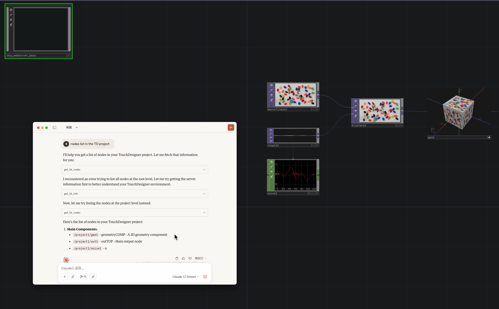
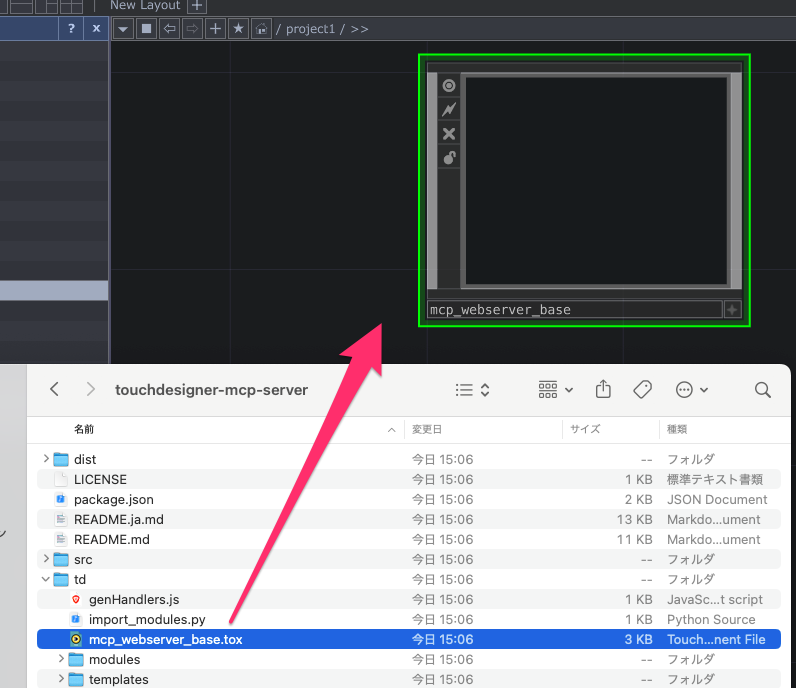

# TouchDesigner MCP

TouchDesignerのためのMCP(Model Context Protocol) サーバー実装です。AIエージェントがTouchDesignerプロジェクトを制御・操作できるようになることを目指しています。

[English](https://github.com/8beeeaaat/touchdesigner-mcp/blob/main/README.md) / [日本語](https://github.com/8beeeaaat/touchdesigner-mcp/blob/main/README.ja.md)

## 概要



TouchDesigner MCPは、AIモデルとTouchDesigner WebServer DAT 間のブリッジとして機能し、AIエージェントが以下のことが可能になります
- ノードの作成、変更、削除
- ノードプロパティやプロジェクト構造の照会
- PythonスクリプトによるTouchDesignerのプログラム的制御

## 利用方法

*Node.js がインストールされていることが前提となります*

### 1. touchdesigner-mcp-server パッケージのインストール

`npm install touchdesigner-mcp-server`

### 2. TouchDesignerとの接続

#### mcp_webserver_base.tox を TouchDesigner に配置

TouchDesignerを起動し、`td/mcp_webserver_base.tox` コンポーネントをTouchDesignerプロジェクト直下にimportします。
例: `/project1/mcp_webserver_base` となるように配置

tox のimport により `td/import_modules.py` スクリプトが動作し、APIサーバのコントローラなどのモジュールがロードされます。



#### APIサーバの動作確認
`npm run test` を実行することでMCPサーバーコードのユニットテストと TouchDesigner への接続テストが実行されます。
このテストでは `td/modules` ディレクトリ内のPythonモジュールが `mcp_webserver_base` コンポーネントからアクセス可能であることを確認します。
TouchDesigner のメニューから Textportを起動すると通信のログを確認することができます。

### 3. TouchDesigner MCP Server の設定
TouchDesignerが起動した状態で、AIエージェント（Claude Desktop,Cursor, VSCode CopilotChatなど）をMCPサーバーに接続するように設定します。

*例 Claude Desktop*
```json
{
  "mcpServers": {
    "touchdesigner": {
      "args": [
        "/path/to/your/touchdesigner-mcp-server/dist/index.js", // <-- touchdesigner-mcp-server/dist/index.js への絶対パスに置き換えてください
        "--stdio"
      ],
      "command": "node",
      "transportType": "stdio"
    }
  }
}
```

MCPサーバーが認識されていればセットアップは完了です。
起動時にエラーが表示される場合はTouchDesignerを先に起動してから再度エージェントを起動してください。
TouchDesigner で APIサーバーが実行されていれば、エージェントは提供された TouchDesigner ツールを通じてTouchDesignerを使用できます。


## MCPサーバーの機能

このサーバーは、Model Context Protocol (MCP) を通じてTouchDesigner への操作、および各種実装ドキュメントへの参照を可能にします。

### ツール (Tools)

ツールは、AIエージェントがTouchDesignerでアクションを実行できるようにします。

| ツール名                    | 説明                                           |
| :-------------------------- | :--------------------------------------------- |
| `create_td_node`            | 新しいノードを作成します。                     |
| `delete_td_node`            | 既存のノードを削除します。                     |
| `exec_node_method`| ノードに対しPythonメソッドを呼び出します。       |
| `execute_python_script`     | TD内で任意のPythonスクリプトを実行します。     |
| `get_td_class_details`      | TD Pythonクラス/モジュールの詳細情報を取得します。 |
| `get_td_classes`            | TouchDesigner Pythonクラスのリストを取得します。 |
| `get_td_info`           | TDサーバー環境に関する情報を取得します。       |
| `get_td_node_parameters`    | 特定ノードのパラメータを取得します。           |
| `get_td_nodes`              | 親パス内のノードを取得します（オプションでフィルタリング）。 |
| `update_td_node_parameters` | 特定ノードのパラメータを更新します。           |

### プロンプト (Prompts)

プロンプトは、AIエージェントがTouchDesignerで特定のアクションを実行するための指示を提供します。

| プロンプト名                | 説明                                           |
| :-------------------------- | :--------------------------------------------- |
| `Search node`               | ノードをファジー検索し、指定されたノード名、ファミリー、タイプに基づいて情報を取得します。 |
| `Node connection`          | TouchDesigner内でノード同士を接続するための指示を提供します。 |
| `Check node errors`               | 指定されたノードのエラーをチェックします。子ノードがあれば再帰的にチェックします。           |

### リソース (Resources)

未実装


## 開発者向け

### MCPサーバーコードのビルド

1. リポジトリのクローン
```bash
git clone https://github.com/8beeeaaat/touchdesigner-mcp.git
```

2. 依存パッケージのインストール
```bash
cd touchdesigner-mcp
npm install
```
3. 環境設定ファイルの設置とビルド
```
# テンプレートをコピーし、必要に応じて TD_WEB_SERVER_URL を調整してください
cp dotenv .env

# プロジェクトのビルド（APIクライアント/サーバー向けスキーマを生成し、MCPリソースをコンパイルします）
# このコマンドを実行する前にDockerデーモンが実行されていることを確認してください
npm run build
```

### TouchDesignerのセットアップ

#### 1.  **コード生成:**
`npm run build` を実行します。これにより以下のコードが生成されます。
- MCPサーバコード
- TouchDesigner WebSever DAT向けのAPIサーバーコード

#### 2.  **TouchDesigner に MCPサーバー向けWebServerをインポートする:**
TouchDesignerを起動し、`td/mcp_webserver_base.tox` コンポーネントをTouchDesignerプロジェクト直下にimportします。
tox のimport により `td/import_modules.py` スクリプトが動作し、APIサーバのコントローラなどのモジュールがロードされます。

#### 3.  **APIサーバの動作確認:**
`td/modules` ディレクトリ内のPythonモジュールが `mcp_webserver_base` コンポーネントからアクセス可能であることを確認します。
`npm run test` を実行することでMCPサーバーコードのユニットテストと TouchDesigner への結合テストが実行されます。
TouchDesigner のメニューから Textportを起動すると通信のログを確認することができます。

`npm run dev` で @modelcontextprotocol/inspector させデバッグすることができます。

*TIPS*
`mcp_webserver_base.tox` には、MCPサーバーとTouchDesignerを連携させるように設定された WebServer DAT が含まれています。
このDATがActiveであり、`.env` ファイルの `TD_WEB_SERVER_URL` で指定されたポートで実行されていることを確認してください。（デフォルト: `9981`）
実行するポートを任意のものに変更したい場合は、以下の手順に従ってください。
1. `.env` ファイルの `TD_WEB_SERVER_PORT` を変更
2. `npm run build` を再実行
3. mcp_webserver_base (WebServer DAT) のポートを変更し、WebServer DATをRestart

### MCP対応 AIエージェントとの接続

TouchDesignerが起動した状態で、AIエージェント（Cursor, Claude Desktop, VSCode CopilotChatなど）をMCPサーバーに接続するように設定します。

#### 例. Claude Desktop
```json
{
  "mcpServers": {
    "dev_touchdesigner": {
      "args": [
        "/path/to/your/touchdesigner-mcp/dist/index.js", // <-- ビルド後の /dist/index.js への絶対パスに置き換えてください
        "--stdio"
      ],
      "command": "node",
      "transportType": "stdio"
    }
  }
}
```

### セットアップ後のプロジェクト構造概要

```
├── src/                       # MCPサーバー ソースコード
│   ├── api/                  # TD WebServerに対するOpenAPI仕様
│   ├── core/                 # コアユーティリティ (ロガー, エラーハンドリング)
│   ├── features/             # MCP機能実装
│   │   ├── prompts/         # プロンプトハンドラ
│   │   ├── resources/       # リソースハンドラ
│   │   └── tools/           # ツールハンドラ (例: tdTools.ts)
│   ├── gen/                  # OpenAPIスキーマから生成されたMCPサーバー向けコード
│   ├── server/               # MCPサーバーロジック (接続, メインサーバークラス)
│   ├── tdClient/             # TD接続API用クライアント
│   ├── index.ts              # Node.jsサーバーのメインエントリーポイント
│   └── ...
├── td/                        # TouchDesigner関連ファイル
│   ├── modules/              # TouchDesigner用Pythonモジュール
│   │   ├── mcp/              # TD内でMCPからのリクエストを処理するコアロジック
│   │   │   ├── controllers/ # APIリクエストコントローラ (api_controller.py, generated_handlers.py)
│   │   │   └── services/    # ビジネスロジック (api_service.py)
│   │   ├── td_server/        # OpenAPIスキーマから生成されたPythonモデルコード
│   │   └── utils/            # 共有Pythonユーティリティ
│   ├── templates/             # Pythonコード生成用Mustacheテンプレート
│   ├── genHandlers.js         # generated_handlers.py 生成用のNode.jsスクリプト
│   ├── import_modules.py      # TDへ APIサーバ関連モジュールをインポートするヘルパースクリプト
│   └── mcp_webserver_base.tox # メインTouchDesignerコンポーネント
├── tests/                      # テストコード
│   ├── integration/
│   └── unit/
├── .env                        # ローカル環境変数 (git無視)
├── dotenv                      # .env用テンプレート
└── orval.config.ts             # Orval 設定 (TSクライアント生成)
```


### APIコード生成ワークフロー

このプロジェクトでは、OpenAPIによるコード生成ツール ( Orval / openapi-generator-cli )を使用しています：

**API定義:** Node.js MCPサーバーとTouchDesigner内で実行されるPythonサーバー間のAPI規約は `src/api/index.yml` で定義されます。

1.  **Pythonサーバー生成 (`npm run gen:webserver`):**
    *   Docker経由で `openapi-generator-cli` を使用します。
    *   `src/api/index.yml` を読み取ります。
    *   API定義に基づいてPythonサーバーのスケルトン (`td/modules/td_server/`) を生成します。このコードはWebServer DATを介してTouchDesigner内で実行されます。
    *   **Dockerがインストールされ、実行されている必要があります。**
2.  **Pythonハンドラ生成 (`npm run gen:handlers`):**
    *   カスタムNode.jsスクリプト (`td/genHandlers.js`) とMustacheテンプレート (`td/templates/`) を使用します。
    *   生成されたPythonサーバーコードまたはOpenAPI仕様を読み取ります。
    *   `td/modules/mcp/services/api_service.py` にあるビジネスロジックに接続するハンドラ実装 (`td/modules/mcp/controllers/generated_handlers.py`) を生成します。
3.  **TypeScriptクライアント生成 (`npm run gen:mcp`):**
    *   `Orval` を使用し `openapi-generator-cli` がバンドルしたスキーマYAMLからAPIクライアントコードとToolの検証に用いるZodスキーマを生成します。
    *   Node.jsサーバーが WebServerDAT にリクエストを行うために使用する、型付けされたTypeScriptクライアント (`src/tdClient/`) を生成します。

ビルドプロセス (`npm run build`) は、必要なすべての生成ステップ (`npm run gen`) を実行し、その後にTypeScriptコンパイル (`tsc`) を行います。

## 開発で貢献

ぜひ一緒に改善しましょう！

1. リポジトリをフォーク
2. 機能ブランチを作成（`git checkout -b feature/amazing-feature`）
3. 変更を加える
4. テストを追加し、すべてが正常に動作することを確認（`npm test`）
5. 変更をコミット（`git commit -m 'Add some amazing feature'`）
6. ブランチにプッシュ（`git push origin feature/amazing-feature`）
7. プルリクエストを開く

実装の変更時は必ず適切なテストを含めてください。

## ライセンス

MIT
