# TouchDesigner MCP

This is an implementation of an MCP (Model Context Protocol) server for TouchDesigner. Its goal is to enable AI agents to control and operate TouchDesigner projects.

[English](https://github.com/8beeeaaat/touchdesigner-mcp/blob/main/README.md) / [日本語](https://github.com/8beeeaaat/touchdesigner-mcp/blob/main/README.ja.md)

## Overview

[](https://youtu.be/V2znaqGU7f4?si=6HDFbcBHCFPdttkM&t=635)

TouchDesigner MCP acts as a bridge between AI models and the TouchDesigner WebServer DAT, enabling AI agents to:

- Create, modify, and delete nodes
- Query node properties and project structure
- Programmatically control TouchDesigner via Python scripts

## Architecture

```mermaid
flowchart LR
    A["🤖<br/>MCP client<br/>(Claude / Codex / ...)"]

    subgraph S [Node.js MCP server]
      B1["🧰<br/>Tools & prompts<br/>(src/features/tools)"]
      B2["🖌️<br/>Presenters & formatters<br/>(markdown output)"]
      B3["🌐<br/>OpenAPI HTTP client<br/>(src/tdClient)"]
    end

    subgraph T [TouchDesigner project]
      C1["🧩<br/>WebServer DAT<br/>(mcp_webserver_base.tox)"]
      C2["🐍<br/>Python controllers / services<br/>(td/modules/mcp)"]
      C3["🎛️<br/>Project nodes & parameters<br/>(/project1/...)"]
    end

    A --> B1
    B1 --> B2
    B1 --> B3
    B2 --> A
    B3 <--> C1
    C1 <--> C2
    C2 <--> C3

    %% Higher-contrast colors for readability
    classDef client fill:#d8e8ff,stroke:#1f6feb,stroke-width:2px,color:#111,font-weight:bold
    classDef server fill:#efe1ff,stroke:#8250df,stroke-width:2px,color:#111,font-weight:bold
    classDef td fill:#d7f5e3,stroke:#2f9e44,stroke-width:2px,color:#111,font-weight:bold
    class A client;
    class B1,B2,B3 server;
    class C1,C2,C3 td;
```



## Usage

<details>
  <summary>Method 1: Using Claude Desktop and MCP Bundle (Recommended)</summary>

### 1. Download Files

Download the following from the [releases page](https://github.com/8beeeaaat/touchdesigner-mcp/releases/latest):

- **TouchDesigner Components**: `touchdesigner-mcp-td.zip`
- **[MCP Bundle](https://github.com/modelcontextprotocol/mcpb) (.mcpb)**: `touchdesigner-mcp.mcpb`

### 2. Set up TouchDesigner Components

1. Extract the TouchDesigner components from `touchdesigner-mcp-td.zip`.
2. Import `mcp_webserver_base.tox` into your TouchDesigner project.
3. Place it at `/project1/mcp_webserver_base`.

<https://github.com/user-attachments/assets/215fb343-6ed8-421c-b948-2f45fb819ff4>

  You can check the startup logs by opening the Textport from the TouchDesigner menu.

  

### 3. Install the MCP Bundle

Double-click the `touchdesigner-mcp.mcpb` file to install the bundle in Claude Desktop.

<https://github.com/user-attachments/assets/0786d244-8b82-4387-bbe4-9da048212854>

### 4. Connect to the Server

The MCP bundle will automatically handle the connection to the TouchDesigner server.

**⚠️ Important:** The directory structure must be preserved exactly as extracted. The `mcp_webserver_base.tox` component references relative paths to the `modules/` directory and other files.

</details>

<details>
  <summary>Method 2: Using npx</summary>

*Requires Node.js to be installed.*

### 1. Set up TouchDesigner Components

1. Download and extract the TouchDesigner components from `touchdesigner-mcp-td.zip` ([releases page](https://github.com/8beeeaaat/touchdesigner-mcp/releases/latest)).
2. Import `mcp_webserver_base.tox` into your TouchDesigner project.
3. Place it at `/project1/mcp_webserver_base`.

<https://github.com/user-attachments/assets/215fb343-6ed8-421c-b948-2f45fb819ff4>

  You can check the startup logs by opening the Textport from the TouchDesigner menu.

  

### 2. Set up the MCP Server Configuration

*Example for Claude Desktop:*

```json
{
  "mcpServers": {
    "touchdesigner": {
      "command": "npx",
      "args": ["-y", "touchdesigner-mcp-server@latest", "--stdio"]
    }
  }
}
```

**Customization:** You can customize the TouchDesigner server connection by adding `--host` and `--port` arguments:

```json
"args": [
  "-y",
  "touchdesigner-mcp-server@latest",
  "--stdio",
  "--host=http://custom_host",
  "--port=9982"
]
```

</details>

<details>
  <summary>Method 3: Using a Docker Image</summary>

  [](https://www.youtube.com/watch?v=BRWoIEVb0TU)

### 1. Clone the repository

  ```bash
  git clone https://github.com/8beeeaaat/touchdesigner-mcp.git
  cd touchdesigner-mcp
  ```

### 2. Build the Docker image

  ```bash
  make build
  ```

### 3. Install the API Server in Your TouchDesigner Project

  Start TouchDesigner and import the `td/mcp_webserver_base.tox` component into the project you want to control.
  Example: Place it at `/project1/mcp_webserver_base`.

  Importing the `.tox` file will trigger the `td/import_modules.py` script, which loads the necessary modules for the API server.

<https://github.com/user-attachments/assets/215fb343-6ed8-421c-b948-2f45fb819ff4>

  You can check the startup logs by opening the Textport from the TouchDesigner menu.

  

### 4. Start the MCP server container

  ```bash
  docker-compose up -d
  ```

### 5. Configure your AI agent to use the Docker container

  *Example for Claude Desktop:*

  ```json
  {
    "mcpServers": {
      "touchdesigner": {
        "command": "docker",
        "args": [
          "compose",
          "-f",
          "/path/to/your/touchdesigner-mcp/docker-compose.yml",
          "exec",
          "-i",
          "touchdesigner-mcp-server",
          "node",
          "dist/cli.js",
          "--stdio",
          "--host=http://host.docker.internal"
        ]
      }
    }
  }
```

  *On Windows systems, include the drive letter, e.g., `C:\path\to\your\touchdesigner-mcp\docker-compose.yml`.*

**Note:** You can customize the TouchDesigner server connection by adding `--host` and `--port` arguments:

  ```json
"args": [
  ...,
  "--stdio",
  "--host=http://host.docker.internal",
  "--port=9982"
]
  ```

</details>

## Verify Connection

If the MCP server is recognized, the setup is complete.
If it's not recognized, try restarting your AI agent.
If you see an error at startup, try launching the agent again after starting TouchDesigner.
When the API server is running properly in TouchDesigner, the agent can use the provided tools to operate it.

### Directory Structure Requirements

**Critical:** When using any method, you must maintain the original directory structure:

```
td/
├── import_modules.py          # Module loader script
├── mcp_webserver_base.tox     # Main TouchDesigner component
└── modules/                   # Python modules directory
    ├── mcp/                   # MCP core logic
    ├── utils/                 # Shared utilities
    └── td_server/             # Generated API server code
```

The `mcp_webserver_base.tox` component uses relative paths to locate Python modules. Moving or reorganizing these files will cause import errors in TouchDesigner.


## MCP Server Features

This server enables AI agents to perform operations in TouchDesigner using the Model Context Protocol (MCP).

### Tools

Tools allow AI agents to perform actions in TouchDesigner.

| Tool Name                | Description                                                        |
| :---------------------- | :----------------------------------------------------------------- |
| `create_td_node`        | Creates a new node.                                                |
| `delete_td_node`        | Deletes an existing node.                                          |
| `exec_node_method`      | Calls a Python method on a node.                                   |
| `execute_python_script` | Executes an arbitrary Python script in TouchDesigner.              |
| `get_module_help`       | Gets Python help() documentation for TouchDesigner modules/classes.|
| `get_td_class_details`  | Gets details of a TouchDesigner Python class or module.            |
| `get_td_classes`        | Gets a list of TouchDesigner Python classes.                       |
| `get_td_info`           | Gets information about the TouchDesigner server environment.       |
| `get_td_node_errors`    | Checks for errors on a specified node and optionally its children. |
| `get_td_node_parameters`| Gets the parameters of a specific node.                            |
| `get_td_nodes`          | Gets nodes under a parent path, with optional filtering.           |
| `update_td_node_parameters` | Updates the parameters of a specific node.                     |

### Prompts

Prompts provide instructions for AI agents to perform specific actions in TouchDesigner.

| Prompt Name         | Description                                                                 |
| :------------------| :-------------------------------------------------------------------------- |
| `Search node`      | Fuzzy searches for nodes and retrieves information based on name, family, or type. |
| `Node connection`  | Provides instructions to connect nodes within TouchDesigner.                |
| `Check node errors`| Checks for errors on a specified node, and recursively for its children.    |

### Resources

Not implemented.

## For Developers

### Quick Start for Development

1. **Set up your environment:**

   ```bash
   # Clone and install dependencies
   git clone https://github.com/8beeeaaat/touchdesigner-mcp.git
   cd touchdesigner-mcp
   npm install
   ```

2. **Build the project:**

   ```bash
   make build        # Docker-based build (recommended)
   # OR
   npm run build     # Node.js-based build
   ```

3. **Available commands:**

   ```bash
   npm run test      # Run unit and integration tests
   npm run dev       # Launch the MCP inspector for debugging
   ```

**Note:** When you update the code, you must restart both the MCP server and TouchDesigner to apply the changes.

### Project Structure Overview

```
├── src/                       # MCP server source code
│   ├── api/                  # OpenAPI spec for the TouchDesigner WebServer
│   ├── core/                 # Core utilities (logger, error handling)
│   ├── features/             # MCP feature implementations
│   │   ├── prompts/         # Prompt handlers
│   │   ├── resources/       # Resource handlers
│   │   └── tools/           # Tool handlers (e.g., tdTools.ts)
│   ├── gen/                  # Code generated from the OpenAPI schema for the MCP server
│   ├── server/               # MCP server logic (connections, main server class)
│   ├── tdClient/             # TouchDesigner connection API client
│   ├── index.ts              # Main entry point for the Node.js server
│   └── ...
├── td/                        # TouchDesigner-related files
│   ├── modules/              # Python modules for TouchDesigner
│   │   ├── mcp/              # Core logic for handling MCP requests in TouchDesigner
│   │   │   ├── controllers/ # API request controllers (api_controller.py, generated_handlers.py)
│   │   │   └── services/    # Business logic (api_service.py)
│   │   ├── td_server/        # Python model code generated from the OpenAPI schema
│   │   └── utils/            # Shared Python utilities
│   ├── templates/             # Mustache templates for Python code generation
│   ├── genHandlers.js         # Node.js script for generating generated_handlers.py
│   ├── import_modules.py      # Helper script to import API server modules into TouchDesigner
│   └── mcp_webserver_base.tox # Main TouchDesigner component
├── tests/                      # Test code
│   ├── integration/
│   └── unit/
└── orval.config.ts             # Orval config (TypeScript client generation)
```

### API Code Generation Workflow

This project uses OpenAPI-based code generation tools (Orval and openapi-generator-cli).

**API Definition:** The API contract between the Node.js MCP server and the Python server running inside TouchDesigner is defined in `src/api/index.yml`.

1. **Python server generation (`npm run gen:webserver`):**
    - Uses `openapi-generator-cli` via Docker.
    - Reads `src/api/index.yml`.
    - Generates a Python server skeleton (`td/modules/td_server/`) based on the API definition. This code runs inside TouchDesigner's WebServer DAT.
    - **Requires Docker to be installed and running.**
2. **Python handler generation (`npm run gen:handlers`):**
    - Uses a custom Node.js script (`td/genHandlers.js`) and Mustache templates (`td/templates/`).
    - Reads the generated Python server code or OpenAPI spec.
    - Generates handler implementations (`td/modules/mcp/controllers/generated_handlers.py`) that connect to the business logic in `td/modules/mcp/services/api_service.py`.
3. **TypeScript client generation (`npm run gen:mcp`):**
    - Uses `Orval` to generate an API client and Zod schemas for tool validation from the schema YAML, which is bundled by `openapi-generator-cli`.
    - Generates a typed TypeScript client (`src/tdClient/`) used by the Node.js server to make requests to the WebServer DAT.

The build process (`npm run build`) runs all necessary generation steps (`npm run gen`), followed by TypeScript compilation (`tsc`).

### Version management

- `package.json` is the single source of truth for every component version (Node.js MCP server, TouchDesigner Python API, MCP bundle, and `server.json` metadata).
- Run `npm version <patch|minor|major>` (or the underlying `npm run gen:version`) whenever you bump the version. The script rewrites `pyproject.toml`, `td/modules/utils/version.py`, `mcpb/manifest.json`, and `server.json` so that the release workflow can trust the tag value.
- The GitHub release workflow (`.github/workflows/release.yml`) tags the commit as `v${version}` and publishes `touchdesigner-mcp-td.zip` / `touchdesigner-mcp.mcpb` from the exact same version number. Always run the sync step before triggering a release so that every artifact stays aligned.

## Troubleshooting

### Troubleshooting version compatibility

- During `ConnectionManager.connect` the MCP server compares its own version with the TouchDesigner API server version reported by `getTdInfo`. If the API server does not expose a version or the versions differ (for example because only one side was updated), the MCP server aborts the connection with a descriptive error message in the Claude/Codex console and in the TouchDesigner log DAT.
- To resolve the mismatch, reinstall both the TouchDesigner components
  1. Download the latest [touchdesigner-mcp-td.zip](https://github.com/8beeeaaat/touchdesigner-mcp/releases/latest/download/touchdesigner-mcp-td.zip) from the releases page.
  2. Delete the existing \`touchdesigner-mcp-td\` folder and replace it with the newly extracted contents.
  3. Remove the old \`mcp_webserver_base\` component from your TouchDesigner project and import the \`.tox\` from the new folder.
  4. Restart TouchDesigner and the AI agent running the MCP server (e.g., Claude Desktop).
- When developing locally, run `npm run gen:version` after editing `package.json` (or simply use `npm version ...`). This keeps the Python API (`pyproject.toml` + `td/modules/utils/version.py`), MCP bundle manifest, and registry metadata in sync so that the runtime compatibility check succeeds.

## Contributing

We welcome your contributions!

1. Fork the repository.
2. Create a feature branch (`git checkout -b feature/amazing-feature`).
3. Make your changes.
4. Add tests and ensure everything works (`npm test`).
5. Commit your changes (`git commit -m 'Add some amazing feature'`).
6. Push to your branch (`git push origin feature/amazing-feature`).
7. Open a pull request.

Please always include appropriate tests when making implementation changes.

## License

MIT
