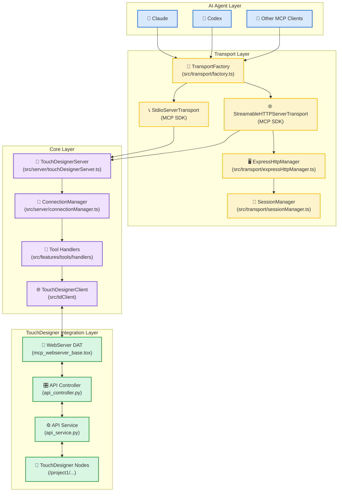
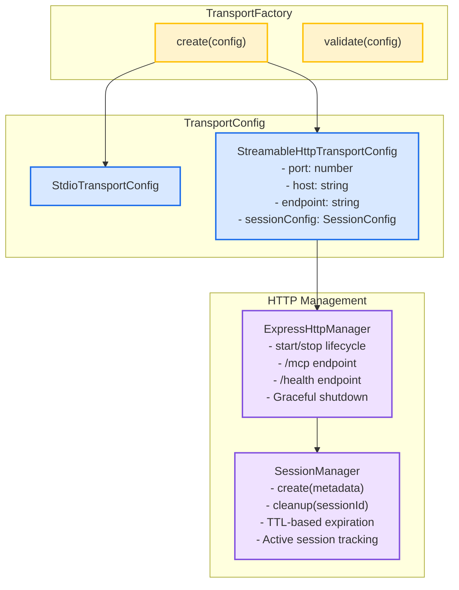
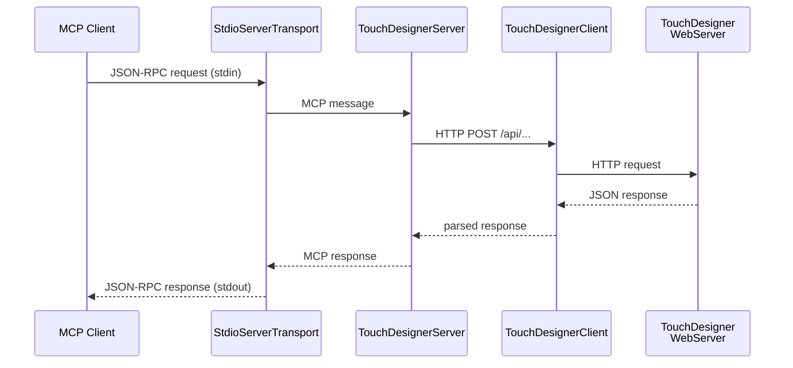
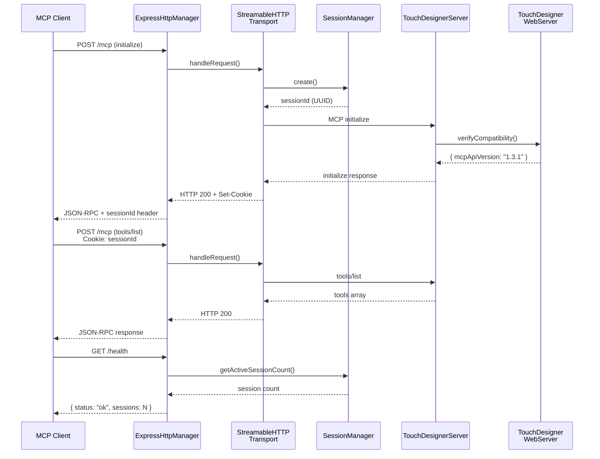
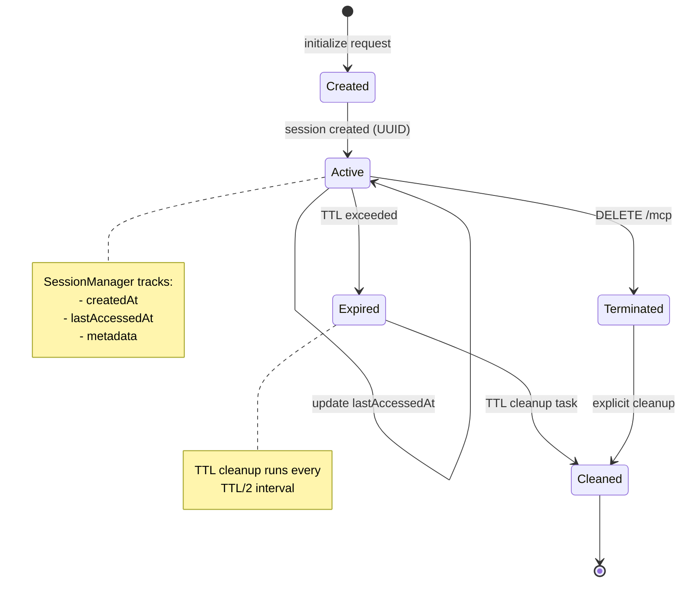

# TouchDesigner MCP Server Architecture

This document describes the architecture of the TouchDesigner MCP server.

## Table of Contents

1. [Overview](#overview)
2. [System Architecture](#system-architecture)
3. [Transport Layer](#transport-layer)
4. [Core Layer](#core-layer)
5. [TouchDesigner Integration Layer](#touchdesigner-integration-layer)
6. [Data Flow](#data-flow)
7. [Design Principles](#design-principles)

---

## Overview

The TouchDesigner MCP Server is an MCP (Model Context Protocol) implementation that connects AI agents (Claude, Codex, etc.) with TouchDesigner projects.

### Key Features

- **Dual-Process Architecture**: Composed of two processes: Node.js MCP server and TouchDesigner Python WebServer
- **Multiple Transport Support**: Supports Stdio (standard I/O) and Streamable HTTP (HTTP + SSE)
- **SDK-First Approach**: Maximizes use of MCP SDK built-in features while minimizing custom code
- **Type Safety**: Strict type checking and runtime validation using TypeScript and Zod

---

## System Architecture

### High-Level Architecture



### Architecture Layers

1. **AI Agent Layer**: MCP clients (Claude, Codex, etc.)
2. **Transport Layer**: Handles MCP protocol communication (Stdio/HTTP)
3. **Core Layer**: MCP server business logic and TouchDesigner client
4. **TouchDesigner Integration Layer**: Python WebServer and node operations within TouchDesigner

---

## Transport Layer

The transport layer provides a pluggable architecture that supports multiple MCP transport protocols.

### Component Structure



### TransportFactory

**Responsibility**: Generate transport instances based on configuration

**Implementation**: [src/transport/factory.ts](../src/transport/factory.ts)

```typescript
class TransportFactory {
  static create(config: TransportConfig): Result<Transport, Error>
}
```

**Supported Transports**:

1. **Stdio**: Standard I/O based transport (default)
   - For local CLI usage
   - No session management required
   - Single connection

2. **Streamable HTTP**: HTTP + SSE based transport
   - For remote clients/web applications
   - Session management support
   - Multiple sessions support

### ExpressHttpManager

**Responsibility**: HTTP server lifecycle management

**Implementation**: [src/transport/expressHttpManager.ts](../src/transport/expressHttpManager.ts)

**Key Features**:

- Express app generation using SDK's `createMcpExpressApp()`
- `/mcp` endpoint: Delegates to `transport.handleRequest()`
- `/health` endpoint: Health check (includes active session count)
- Graceful shutdown

**Endpoint Configuration**:

```typescript
// MCP protocol endpoints
app.post('/mcp', handleMcpRequest); // JSON-RPC requests
app.get('/mcp', handleMcpRequest);  // SSE streaming
app.delete('/mcp', handleMcpRequest); // Session termination

// Health check
app.get('/health', (req, res) => {
  res.json({
    status: 'ok',
    sessions: sessionManager.getActiveSessionCount(),
    timestamp: new Date().toISOString()
  });
});
```

### SessionManager

**Responsibility**: Client session management

**Implementation**: [src/transport/sessionManager.ts](../src/transport/sessionManager.ts)

**Key Features**:

- Session creation (UUID v4)
- Session cleanup
- TTL-based automatic expiration
- Active session tracking

**SDK Integration**:

- Session validation is handled by SDK (`StreamableHTTPServerTransport.handleRequest()`)
- SessionManager focuses on session tracking and TTL cleanup

```typescript
interface ISessionManager {
  create(metadata?: Record<string, unknown>): string;
  cleanup(sessionId: string): Result<void, Error>;
  list(): Session[];
  startTTLCleanup(): void;
  stopTTLCleanup(): void;
  getActiveSessionCount(): number;
}
```

---

## Core Layer

The core layer handles MCP server business logic and communication with TouchDesigner WebServer.

### TouchDesignerServer

**Responsibility**: Main entry point for MCP server

**Implementation**: [src/server/touchDesignerServer.ts](../src/server/touchDesignerServer.ts)

**Key Features**:

- Transport connection management
- Registration of MCP tools, prompts, and resources
- TouchDesigner compatibility verification

```typescript
class TouchDesignerServer {
  async connect(transport: Transport): Promise<Result<void, Error>>
  async disconnect(): Promise<Result<void, Error>>
  getTransportInfo(): TransportInfo
}
```

### ConnectionManager

**Responsibility**: Transport connection lifecycle management

**Implementation**: [src/server/connectionManager.ts](../src/server/connectionManager.ts)

**Key Features**:

- Transport-agnostic connection management
- Connection metadata tracking
- Transport type detection

```typescript
class ConnectionManager {
  async connect(transport: Transport): Promise<Result<void, Error>>
  async disconnect(): Promise<Result<void, Error>>
  getTransportType(): TransportType | null
  getConnectionMetadata(): ConnectionMetadata
  isConnected(): boolean
}
```

### Tool Handlers

**Implementation**: [src/features/tools/handlers/tdTools.ts](../src/features/tools/handlers/tdTools.ts)

MCP tool implementations categorized as follows:

1. **Node Operations**:
   - `create_td_node`: Create node
   - `delete_td_node`: Delete node
   - `get_td_nodes`: Get node list

2. **Parameter Operations**:
   - `get_td_node_parameters`: Get parameters
   - `update_td_node_parameters`: Update parameters

3. **Python Execution**:
   - `execute_python_script`: Execute Python script

4. **Class/Module**:
   - `get_td_classes`: Get TouchDesigner class list
   - `get_td_class_details`: Get class details
   - `get_td_module_help`: Get module help

### TouchDesignerClient

**Implementation**: [src/tdClient/](../src/tdClient/)

**Responsibility**: HTTP communication with TouchDesigner WebServer

- Auto-generated from OpenAPI schema
- Type safety with Zod schemas
- Connection pooling

---

## TouchDesigner Integration Layer

The TouchDesigner integration layer handles Python WebServer and node operations within TouchDesigner.

### WebServer DAT Component

**File**: [td/mcp_webserver_base.tox](../td/mcp_webserver_base.tox)

**Responsibility**: Provide HTTP API endpoints

**Key Features**:

- HTTP API endpoints based on OpenAPI specification
- JSON-RPC style request/response
- Error handling and logging

### Python Controllers & Services

**Implementation**: [td/modules/mcp/](../td/modules/mcp/)

**Key Components**:

1. **api_controller.py**: HTTP request routing
2. **api_service.py**: Business logic for TouchDesigner operations
3. **generated_handlers.py**: Auto-generated handler stubs

**Node Operation Example**:

```python
# Node creation
def create_node(parent_path: str, node_type: str, node_name: str = None):
    parent = op(parent_path)
    node = parent.create(node_type, node_name)
    return {
        'path': node.path,
        'type': node.type,
        'name': node.name
    }
```

---

## Data Flow

### Stdio Transport Flow



### HTTP Transport Flow



### Session Lifecycle



---

## Design Principles

### 1. Clean Architecture

Follows layer separation and dependency inversion principles:

- **Transport Layer**: Protocol handling only
- **Core Layer**: Business logic
- **Integration Layer**: Connection with external systems (TouchDesigner)

### 2. SDK-First Approach

Maximizes use of MCP SDK built-in features:

- Minimize custom code
- Rely on standard implementations
- Automatically benefit from SDK updates

### 3. Type Safety

Strict type safety with TypeScript and Zod:

- Compile-time type checking
- Runtime validation
- Centralized type definitions and schemas

### 4. Result Pattern

Consistent error handling:

```typescript
type Result<T, E = Error> =
  | { success: true; data: T }
  | { success: false; error: E };
```

### 5. Interface-Driven Design

Interface-driven design for testability and extensibility:

```typescript
interface ISessionManager {
  create(metadata?: Record<string, unknown>): string;
  cleanup(sessionId: string): Result<void, Error>;
  // ...
}

interface ILogger {
  sendLog(params: { level: string; data: string; logger: string }): void;
}
```

### 6. OpenAPI-Based Code Generation

Code generation from OpenAPI schema:

- **Schema-First**: [src/api/index.yml](../src/api/index.yml)
- **Python Server**: Generated with `openapi-generator-cli`
- **TypeScript Client**: Generated with Orval
- **Zod Schemas**: Generated with Orval

Generation Process:

```bash
npm run gen:webserver  # Python server generation
npm run gen:handlers   # Python handlers generation
npm run gen:mcp        # TypeScript client + Zod schemas
npm run gen            # Run all generation steps
```

---

## Extensibility

### Adding New Transports

1. Define configuration type in `src/transport/config.ts`
2. Add Zod schema
3. Add new case to `TransportFactory.create()`
4. Implement transport-specific manager (if needed)

**Example (WebSocket)**:

```typescript
// 1. Define config
export interface WebSocketTransportConfig {
  type: 'websocket';
  port: number;
  path?: string;
}

// 2. Add to union type
export type TransportConfig =
  | StdioTransportConfig
  | StreamableHttpTransportConfig
  | WebSocketTransportConfig;

// 3. Extend factory
static create(config: TransportConfig): Result<Transport, Error> {
  switch (config.type) {
    case 'stdio':
      return this.createStdio();
    case 'streamable-http':
      return this.createStreamableHttp(config);
    case 'websocket':
      return this.createWebSocket(config);
  }
}
```

### Adding New MCP Tools

1. Add endpoint definition to OpenAPI schema
2. Generate code with `npm run gen`
3. Implement business logic in Python service
4. Implement TypeScript tool handler

---

## References

### MCP Specification

- [MCP Specification - Transports](https://modelcontextprotocol.io/specification/2025-03-26/basic/transports)
- [Streamable HTTP Transport](https://modelcontextprotocol.io/specification/2025-03-26/basic/transports#http-with-sse)

### MCP TypeScript SDK

- [SDK Repository](https://github.com/modelcontextprotocol/typescript-sdk)
- [Express Integration](https://github.com/modelcontextprotocol/typescript-sdk/blob/main/src/server/express.ts)

---

**Document Version**: 1.0
**Last Updated**: 2025-12-06
**Status**: Complete
