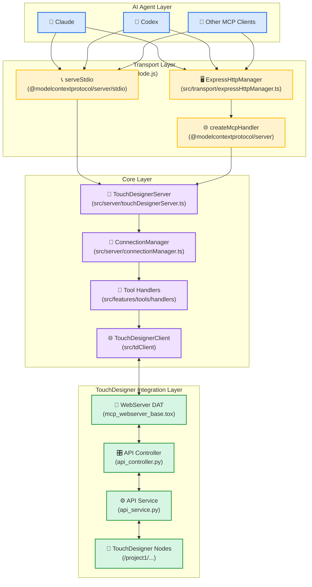
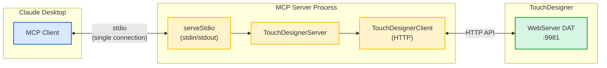
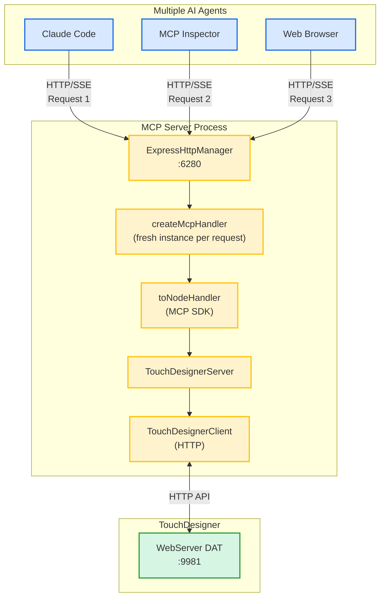
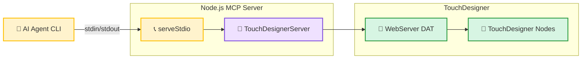
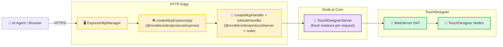
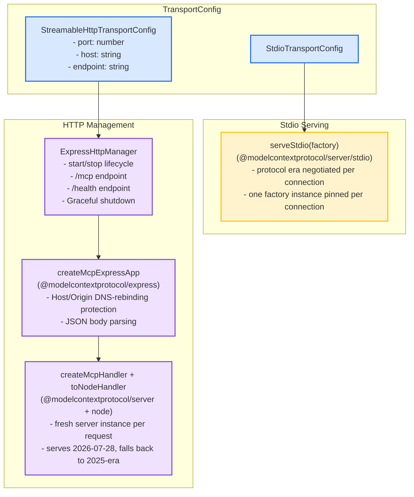
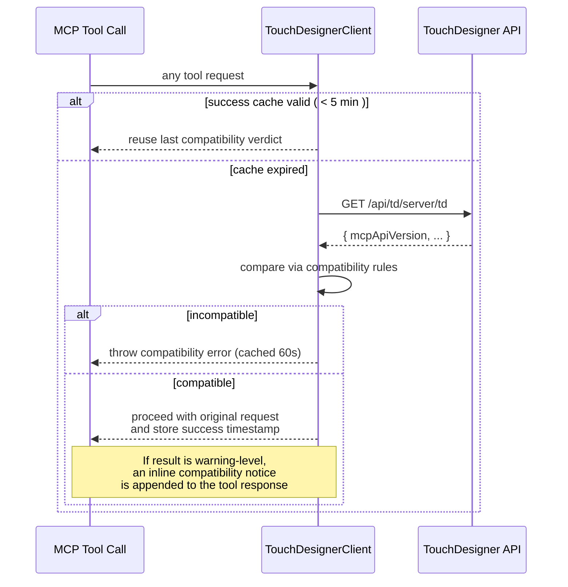
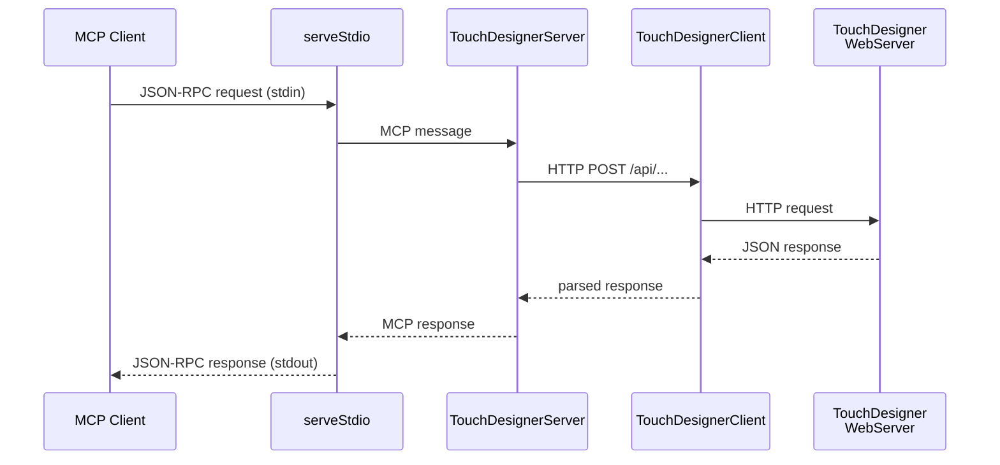
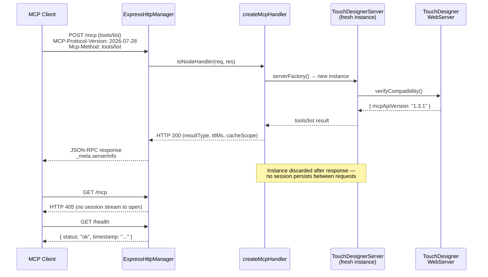

# TouchDesigner MCP Server Architecture

This document describes the architecture of the TouchDesigner MCP server.

## Table of Contents

1. [Overview](#overview)
2. [System Architecture](#system-architecture)
3. [Transport Layer](#transport-layer)
4. [Core Layer](#core-layer)
5. [TouchDesigner Integration Layer](#touchdesigner-integration-layer)
6. [Data Flow](#data-flow)
7. [Transport Selection Guide](#transport-selection-guide)
8. [Design Principles](#design-principles)

---

## Overview

The TouchDesigner MCP Server is an MCP (Model Context Protocol) implementation that connects AI agents (Claude, Codex, etc.) with TouchDesigner projects.

### Key Features

- **Dual-Process Architecture**: Composed of two processes: Node.js MCP server and TouchDesigner Python WebServer
- **Multiple Transport Support**: Supports Stdio (standard I/O) and Streamable HTTP (HTTP + SSE)
- **SDK-First Approach**: Maximizes use of MCP SDK built-in features while minimizing custom code
- **Type Safety**: Strict type checking and runtime validation using TypeScript and Zod

---

## System Architecture

### High-Level Architecture


```mermaid
flowchart TB
    subgraph Client ["AI Agent Layer"]
        A1["🤖 Claude"]
        A2["🤖 Codex"]
        A3["🤖 Other MCP Clients"]
    end

    subgraph Transport ["Transport Layer<br/>(Node.js)"]
        B2["📞 serveStdio<br/>(@modelcontextprotocol/server/stdio)"]
        B3["🌐 createMcpHandler<br/>(@modelcontextprotocol/server)"]
        B4["🖥️ ExpressHttpManager<br/>(src/transport/expressHttpManager.ts)"]
    end

    subgraph Core ["Core Layer<br/>(Node.js)"]
        C1["🎯 TouchDesignerServer<br/>(src/server/touchDesignerServer.ts)"]
        C2["🔌 ConnectionManager<br/>(src/server/connectionManager.ts)"]
        C3["🧰 Tool Handlers<br/>(src/features/tools/handlers)"]
        C4["🌐 TouchDesignerClient<br/>(src/tdClient)"]
    end

    subgraph TD ["TouchDesigner Integration Layer<br/>(Python)"]
        D1["🧩 WebServer DAT<br/>(mcp_webserver_base.tox)"]
        D2["🎛️ API Controller<br/>(api_controller.py)"]
        D3["⚙️ API Service<br/>(api_service.py)"]
        D4["🎨 TouchDesigner Nodes<br/>(/project1/...)"]
    end

    A1 & A2 & A3 --> B2 & B4
    B4 --> B3
    B2 & B3 --> C1
    C1 --> C2
    C2 --> C3
    C3 --> C4
    C4 <--> D1
    D1 <--> D2
    D2 <--> D3
    D3 <--> D4

    classDef client fill:#d8e8ff,stroke:#1f6feb,stroke-width:2px
    classDef transport fill:#fff3cd,stroke:#ffc107,stroke-width:2px
    classDef core fill:#efe1ff,stroke:#8250df,stroke-width:2px
    classDef td fill:#d7f5e3,stroke:#2f9e44,stroke-width:2px

    class A1,A2,A3 client
    class B2,B3,B4 transport
    class C1,C2,C3,C4 core
    class D1,D2,D3,D4 td
```

### Connection Modes Comparison

#### Stdio Mode Architecture


```mermaid
flowchart LR
    subgraph Client ["Claude Desktop"]
        C1["MCP Client"]
    end

    subgraph Server ["MCP Server Process"]
        S1["serveStdio<br/>(stdin/stdout)"]
        S2["TouchDesignerServer"]
        S3["TouchDesignerClient<br/>(HTTP)"]
    end

    subgraph TD ["TouchDesigner"]
        T1["WebServer DAT<br/>:9981"]
    end

    C1 <-->|"stdio<br/>(single connection)"| S1
    S1 --> S2
    S2 --> S3
    S3 <-->|"HTTP API"| T1

    classDef client fill:#d8e8ff,stroke:#1f6feb,stroke-width:2px
    classDef server fill:#fff3cd,stroke:#ffc107,stroke-width:2px
    classDef td fill:#d7f5e3,stroke:#2f9e44,stroke-width:2px

    class C1 client
    class S1,S2,S3 server
    class T1 td
```

**Key Characteristics**:

- **Single Process**: 1 MCP server process = 1 client connection
- **Standard I/O**: Communication via stdin/stdout pipes
- **No Session Management**: Direct 1:1 connection
- **Local Only**: Cannot accept remote connections

#### Streamable HTTP Mode Architecture


```mermaid
flowchart TB
    subgraph Clients ["Multiple AI Agents"]
        C1["Claude Code"]
        C2["MCP Inspector"]
        C3["Web Browser"]
    end

    subgraph Server ["MCP Server Process"]
        direction TB
        S1["ExpressHttpManager<br/>:6280"]
        S2["createMcpHandler<br/>(fresh instance per request)"]
        S3["toNodeHandler<br/>(MCP SDK)"]
        S4["TouchDesignerServer"]
        S5["TouchDesignerClient<br/>(HTTP)"]

        S1 --> S2
        S2 --> S3
        S3 --> S4
        S4 --> S5
    end

    subgraph TD ["TouchDesigner"]
        T1["WebServer DAT<br/>:9981"]
    end

    C1 -->|"HTTP/SSE<br/>Request 1"| S1
    C2 -->|"HTTP/SSE<br/>Request 2"| S1
    C3 -->|"HTTP/SSE<br/>Request 3"| S1

    S5 <-->|"HTTP API"| T1

    classDef client fill:#d8e8ff,stroke:#1f6feb,stroke-width:2px
    classDef server fill:#fff3cd,stroke:#ffc107,stroke-width:2px
    classDef td fill:#d7f5e3,stroke:#2f9e44,stroke-width:2px

    class C1,C2,C3 client
    class S1,S2,S3,S4,S5 server
    class T1 td
```

**Key Characteristics**:

- **Stateless Serving**: Every request gets a freshly-instantiated `TouchDesignerServer` from `createMcpHandler`'s factory — no protocol-level session, no `Mcp-Session-Id` header
- **HTTP/SSE**: RESTful API + Server-Sent Events for streaming
- **Dual Protocol Era**: Serves revision 2026-07-28 and falls back to stateless serving for 2025-era clients, from the same endpoint
- **Network Accessible**: Can accept remote connections
- **No Shared In-Memory State**: Concurrent clients don't share or contend for server instances

#### Architecture Layers

**Stdio Mode**


```mermaid
flowchart LR
    A["🤖 AI Agent CLI"]

    subgraph Node ["Node.js MCP Server"]
        T1["📞 serveStdio"]
        S1["🎯 TouchDesignerServer"]
    end

    subgraph TD ["TouchDesigner"]
        W1["🧩 WebServer DAT"]
        P1["🎨 TouchDesigner Nodes"]
    end

    A -->|"stdin/stdout"| T1 --> S1 --> W1 --> P1

    classDef node fill:#fff3cd,stroke:#ffc107,stroke-width:2px
    classDef core fill:#efe1ff,stroke:#8250df,stroke-width:2px
    classDef td fill:#d7f5e3,stroke:#2f9e44,stroke-width:2px

    class T1 node
    class S1 core
    class W1,P1 td
```

**Streamable HTTP Mode**


```mermaid
flowchart LR
    C["🤖 AI Agent / Browser"]
    subgraph HTTP ["HTTP Edge"]
        H1["🖥️ ExpressHttpManager"]
        H2["🌐 createMcpExpressApp<br/>(@modelcontextprotocol/express)"]
        H3["📡 createMcpHandler + toNodeHandler<br/>(@modelcontextprotocol/server + node)"]
    end

    subgraph NodeCore ["Node.js Core"]
        S2["🎯 TouchDesignerServer<br/>(fresh instance per request)"]
    end

    subgraph TouchDesigner ["TouchDesigner"]
        W2["🧩 WebServer DAT"]
        P2["🎨 TouchDesigner Nodes"]
    end

    C -->|"HTTPS"| H1 --> H2 --> H3 --> S2 --> W2 --> P2

    classDef transport fill:#fff3cd,stroke:#ffc107,stroke-width:2px
    classDef core fill:#efe1ff,stroke:#8250df,stroke-width:2px
    classDef td fill:#d7f5e3,stroke:#2f9e44,stroke-width:2px

    class H1,H2,H3 transport
    class S2 core
    class W2,P2 td
```

---

## Transport Layer

The transport layer provides a pluggable architecture that supports multiple MCP transport protocols.

### Component Structure


```mermaid
graph TB
    subgraph Config ["TransportConfig"]
        C1["StdioTransportConfig"]
        C2["StreamableHttpTransportConfig<br/>- port: number<br/>- host: string<br/>- endpoint: string"]
    end

    subgraph Stdio ["Stdio Serving"]
        D1["serveStdio(factory)<br/>(@modelcontextprotocol/server/stdio)<br/>- protocol era negotiated per connection<br/>- one factory instance pinned per connection"]
    end

    subgraph HTTP ["HTTP Management"]
        H1["ExpressHttpManager<br/>- start/stop lifecycle<br/>- /mcp endpoint<br/>- /health endpoint<br/>- Graceful shutdown"]
        H2["createMcpExpressApp<br/>(@modelcontextprotocol/express)<br/>- Host/Origin DNS-rebinding protection<br/>- JSON body parsing"]
        H3["createMcpHandler + toNodeHandler<br/>(@modelcontextprotocol/server + node)<br/>- fresh server instance per request<br/>- serves 2026-07-28, falls back to 2025-era"]
    end

    C1 --> D1
    C2 --> H1
    H1 --> H2
    H2 --> H3

    classDef config fill:#d8e8ff,stroke:#1f6feb,stroke-width:2px
    classDef stdio fill:#fff3cd,stroke:#ffc107,stroke-width:2px
    classDef http fill:#efe1ff,stroke:#8250df,stroke-width:2px

    class C1,C2 config
    class D1 stdio
    class H1,H2,H3 http
```

### Stdio Serving

**Responsibility**: Speak the MCP protocol over stdin/stdout, picking the wire era per connection

**Implementation**: [src/cli.ts](../src/cli.ts) via `serveStdio` from `@modelcontextprotocol/server/stdio`

**Key Features**:

- The opening exchange on each connection selects protocol revision 2026-07-28 or falls back to the legacy handshake for older clients
- One server instance from the factory (`() => TouchDesignerServer.create()`) is pinned for the lifetime of the connection
- `ConnectionManager` ([src/server/connectionManager.ts](../src/server/connectionManager.ts)) remains as a thin wrapper around `server.connect()`, but the production stdio entry point goes through `serveStdio`

### ExpressHttpManager

**Responsibility**: HTTP server lifecycle management for stateless per-request MCP serving

**Implementation**: [src/transport/expressHttpManager.ts](../src/transport/expressHttpManager.ts)

**Key Features**:

- `createMcpHandler(serverFactory)` from `@modelcontextprotocol/server` builds a handler that creates a fresh `TouchDesignerServer` instance for every request — there is no protocol-level session and no `Mcp-Session-Id` header. It serves revision 2026-07-28 and falls back to stateless serving for 2025-era clients on the same endpoint.
- `toNodeHandler` from `@modelcontextprotocol/node` adapts the handler to a Node.js request handler.
- `createMcpExpressApp` from `@modelcontextprotocol/express` builds the Express app, providing Host/Origin DNS-rebinding protection and JSON body parsing.
- `/mcp` accepts all methods; `GET`/`DELETE` return `405` since there is no session stream to open or terminate.
- `/health` returns `{ status: 'ok', timestamp }` — no session count, since none is tracked.
- Graceful shutdown closes open subscription streams via `handler.close()`, then closes the HTTP server.

**Request Handling Flow**:

```typescript
this.handler = createMcpHandler(() => this.serverFactory(), {
  onerror: logHandlerError,
});

const app = createMcpExpressApp({ host: this.config.host });

const nodeHandler = toNodeHandler(this.handler, { onerror: logHandlerError });
app.all(this.config.endpoint, (req, res) => {
  void nodeHandler(req, res, req.body);
});

app.get('/health', (_req, res) => {
  res.json({ status: 'ok', timestamp: new Date().toISOString() });
});
```

### Stateless Request Handling

Every request to `/mcp` is served independently — there is no session store to route through:

```text
Client → POST /mcp (tools/list) → createMcpHandler invokes serverFactory()
                                 → New TouchDesignerServer instance handles this request only
                                 → Response returned, instance discarded

Client → POST /mcp (tools/call) → createMcpHandler invokes serverFactory()
                                 → Another fresh TouchDesignerServer instance
                                 → Response returned, instance discarded
```

There is no `mcp-session-id` header and no session store: protocol version and capabilities travel per-request inside the `_meta` envelope (`io.modelcontextprotocol/protocolVersion`, `io.modelcontextprotocol/clientCapabilities`), and any state a client needs across calls is carried via server-minted handles rather than server-side session storage.

---

## Core Layer

The core layer handles MCP server business logic and communication with TouchDesigner WebServer.

### TouchDesignerServer

**Responsibility**: Main entry point for MCP server

**Implementation**: [src/server/touchDesignerServer.ts](../src/server/touchDesignerServer.ts)

**Key Features**:

- Transport connection management
- Registration of MCP tools, prompts, and resources
- TouchDesigner compatibility verification

```typescript
class TouchDesignerServer {
  async connect(transport: Transport): Promise<Result<void, Error>>
  async disconnect(): Promise<Result<void, Error>>
  getTransportInfo(): TransportInfo
}
```

### ConnectionManager

**Responsibility**: Transport connection lifecycle management

**Implementation**: [src/server/connectionManager.ts](../src/server/connectionManager.ts)

**Key Features**:

- Transport-agnostic connection management
- Connection metadata tracking
- Transport type detection

```typescript
class ConnectionManager {
  async connect(transport: Transport): Promise<Result<void, Error>>
  async disconnect(): Promise<Result<void, Error>>
  getTransportType(): TransportType | null
  getConnectionMetadata(): ConnectionMetadata
  isConnected(): boolean
}
```

### Tool Handlers

**Definitions**: [src/features/tools/toolDefinitions.ts](../src/features/tools/toolDefinitions.ts) — the `TOOL_DEFINITIONS` table is the single source of truth for each tool's name, description, input schema, and handler.

**Registration**: [src/features/tools/handlers/tdTools.ts](../src/features/tools/handlers/tdTools.ts) — registers every `TOOL_DEFINITIONS` entry in a loop plus the `describe_td_tools` meta tool, whose manifest (parameter metadata) is derived from each tool's Zod schema by introspection ([metadata/touchDesignerToolMetadata.ts](../src/features/tools/metadata/touchDesignerToolMetadata.ts)).

MCP tool implementations categorized as follows:

1. **Node Operations**:
   - `create_td_node`: Create node
   - `delete_td_node`: Delete node
   - `get_td_nodes`: Get node list

2. **Parameter Operations**:
   - `get_td_node_parameters`: Get parameters
   - `update_td_node_parameters`: Update parameters

3. **Python Execution**:
   - `execute_python_script`: Execute Python script

4. **Class/Module**:
   - `get_td_classes`: Get TouchDesigner class list
   - `get_td_class_details`: Get class details
   - `get_td_module_help`: Get module help

### TouchDesignerClient

**Implementation**: [src/tdClient/](../src/tdClient/)

**Responsibility**: HTTP communication with TouchDesigner WebServer

- Auto-generated from OpenAPI schema
- Type safety with Zod schemas
- Connection pooling

#### Version Compatibility Verification

`TouchDesignerClient` includes a built-in compatibility gate in [src/tdClient/touchDesignerClient.ts](../src/tdClient/touchDesignerClient.ts) that protects every tool call from running against outdated TouchDesigner `.tox` files. Without this guard the MCP server might call APIs that no longer exist (or behaved differently) in older `.tox` packages, which would lead to silent TouchDesigner errors. By failing fast with structured guidance, agents can prompt users to update their TouchDesigner components before any destructive action is taken.

- `verifyCompatibility()` runs before any API call. It first checks the **success cache** (valid for 5 minutes) via `hasValidSuccessCache()`; if expired it forces a new handshake.
- `verifyVersionCompatibility()` fetches `/api/td/server/td` (`getTdInfo`) and compares the component's `mcpApiVersion` against the release's expected/minimum API versions (`mcpCompatibility` in `package.json`) using the rules in `core/compatibility.ts`. The npm package version does not participate in the decision — the package and API version axes are independent.
- Compatibility failures are cached through `verifiedCompatibilityError` for 60 seconds (`ERROR_CACHE_TTL_MS`) so repeated tool calls surface the same guidance without spamming TouchDesigner.
- Manual version checks such as `get_td_info` call `invalidateCompatibilityCache()` to bypass the success cache and always re-verify.
- When the API is still usable but versions differ (warning level), a **compatibility notice** is stored and appended to every tool response so users see upgrade prompts inline, not just in transport-level notifications.


```mermaid
sequenceDiagram
    participant Tool as MCP Tool Call
    participant Client as TouchDesignerClient
    participant TD as TouchDesigner API

    Tool->>Client: any tool request
    alt success cache valid ( < 5 min )
        Client-->>Tool: reuse last compatibility verdict
    else cache expired
        Client->>TD: GET /api/td/server/td
        TD-->>Client: { mcpApiVersion, ... }
        Client->>Client: compare via compatibility rules
        alt incompatible
            Client-->>Tool: throw compatibility error (cached 60s)
        else compatible
            Client-->>Tool: proceed with original request<br/>and store success timestamp
            Note over Client,Tool: If result is warning-level,<br>an inline compatibility notice<br>is appended to the tool response
        end
    end
```

This mechanism balances safety and performance: normal operations reuse cached verdicts, but users still see timely upgrade prompts when their TouchDesigner API server is too old. For user-facing guidance see the ["Troubleshooting version compatibility" section](../README.md#troubleshooting-version-compatibility).

---

## TouchDesigner Integration Layer

The TouchDesigner integration layer handles Python WebServer and node operations within TouchDesigner.

### WebServer DAT Component

**File**: [td/mcp_webserver_base.tox](../td/mcp_webserver_base.tox)

**Responsibility**: Provide HTTP API endpoints

**Key Features**:

- HTTP API endpoints based on OpenAPI specification
- JSON-RPC style request/response
- Error handling and logging

### Python Controllers & Services

**Implementation**: [td/modules/mcp/](../td/modules/mcp/)

**Key Components**:

1. **api_controller.py**: HTTP request routing
2. **api_service.py**: Business logic for TouchDesigner operations
3. **generated_handlers.py**: Auto-generated handler stubs

**Node Operation Example**:

```python
# Node creation
def create_node(parent_path: str, node_type: str, node_name: str = None):
    parent = op(parent_path)
    node = parent.create(node_type, node_name)
    return {
        'path': node.path,
        'type': node.type,
        'name': node.name
    }
```

---

## Data Flow

### Stdio Transport Flow


```mermaid
sequenceDiagram
    participant Client as MCP Client
    participant Stdio as serveStdio
    participant Server as TouchDesignerServer
    participant TDClient as TouchDesignerClient
    participant TD as TouchDesigner<br/>WebServer

    Client->>Stdio: JSON-RPC request (stdin)
    Stdio->>Server: MCP message
    Server->>TDClient: HTTP POST /api/...
    TDClient->>TD: HTTP request
    TD-->>TDClient: JSON response
    TDClient-->>Server: parsed response
    Server-->>Stdio: MCP response
    Stdio-->>Client: JSON-RPC response (stdout)
```

### HTTP Transport Flow


```mermaid
sequenceDiagram
    participant Client as MCP Client
    participant Express as ExpressHttpManager
    participant Handler as createMcpHandler
    participant Server as TouchDesignerServer<br/>(fresh instance)
    participant TD as TouchDesigner<br/>WebServer

    Client->>Express: POST /mcp (tools/list)<br/>MCP-Protocol-Version: 2026-07-28<br/>Mcp-Method: tools/list
    Express->>Handler: toNodeHandler(req, res)
    Handler->>Server: serverFactory() → new instance
    Server->>TD: verifyCompatibility()
    TD-->>Server: { mcpApiVersion: "1.3.1" }
    Server-->>Handler: tools/list result
    Handler-->>Express: HTTP 200 (resultType, ttlMs, cacheScope)
    Express-->>Client: JSON-RPC response<br/>_meta.serverInfo
    Note over Handler,Server: Instance discarded after response —<br/>no session persists between requests

    Client->>Express: GET /mcp
    Express-->>Client: HTTP 405 (no session stream to open)

    Client->>Express: GET /health
    Express-->>Client: { status: "ok", timestamp: "..." }
```

### Stateless Request Lifecycle

Each HTTP request is handled independently — there is no per-connection session to create, track, or expire:

1. The client sends a request carrying the `_meta` envelope with its protocol version and capabilities (2026-07-28), or is served through the legacy stateless fallback for 2025-era clients.
2. `createMcpHandler` invokes `serverFactory()`, producing a fresh `TouchDesignerServer` / `McpServer` instance scoped to this request only.
3. The instance handles the request and returns a response — list results carry `ttlMs`/`cacheScope` (SEP-2549), and the response includes `Mcp-Method`/`Mcp-Name` headers (SEP-2243) — then the instance is discarded.
4. Any state a client needs across calls travels via server-minted handles carried in request/response payloads, not server-side session storage.

---

## Transport Selection Guide

### Overview

The TouchDesigner MCP Server supports two transport modes, each optimized for different use cases. Both modes provide identical functionality through the same `TouchDesignerServer` implementation—the only difference is the communication protocol.

### Transport Comparison

| Feature | Stdio Mode | HTTP Mode |
| --- | --- | --- |
| **Connection** | Standard I/O (stdin/stdout) | HTTP/SSE (Server-Sent Events) |
| **Use Case** | Local CLI tools, desktop applications | Remote agents, web applications, microservices |
| **State Model** | Single connection, one factory instance pinned per connection | Stateless — fresh server instance per request, no `Mcp-Session-Id` |
| **Concurrency** | 1 process = 1 connection | Multiple concurrent requests, no session affinity |
| **Remote Access** | Not supported | Supported (network accessible) |
| **Health Check** | Not available | `GET /health` endpoint |
| **Monitoring** | Limited | Liveness via `/health` |
| **Debugging** | Requires MCP Inspector | Standard HTTP tools (curl, Postman, browser DevTools) |
| **Scalability** | Limited (1:1 process model) | High (stateless, load balancing, horizontal scaling) |
| **Security** | Process isolation | DNS rebinding protection (Host/Origin validation) |
| **Deployment** | Simple (local binary) | Requires HTTP server setup |

### When to Use Stdio Mode

**Best For**:

- Local development and testing
- Claude Desktop integration
- Single-user desktop applications
- Development environments where simplicity is prioritized
- Scenarios requiring strict process isolation

**Example Use Cases**:

1. **Claude Desktop Integration**

   ```json
   {
     "mcpServers": {
       "touchdesigner": {
         "command": "npx",
         "args": ["-y", "touchdesigner-mcp-server@latest", "--stdio"]
       }
     }
   }
   ```

2. **Local Development**

   ```bash
   # Direct MCP server execution
   npx touchdesigner-mcp-server --stdio

   # With MCP Inspector for debugging
   npx @modelcontextprotocol/inspector node dist/cli.js --stdio
   ```

3. **Docker Integration** (Local)

   ```json
   {
     "mcpServers": {
       "touchdesigner": {
         "command": "docker",
         "args": [
           "compose", "-f", "/path/to/docker-compose.yml",
           "exec", "-i", "touchdesigner-mcp-server",
           "node", "dist/cli.js", "--stdio",
           "--host=http://host.docker.internal"
         ]
       }
     }
   }
   ```

**Advantages**:

- Simple setup (no port configuration)
- Strong process isolation
- No network exposure
- Minimal attack surface
- Works with standard POSIX tools

**Limitations**:

- Cannot accept remote connections
- Limited to single client
- No built-in health checking
- Harder to debug (requires specialized tools)

### When to Use HTTP Mode

**Best For**:

- Production deployments
- Web application integrations
- Remote access scenarios
- Multiple concurrent clients
- Monitoring and observability requirements
- Scalable architectures

**Example Use Cases**:

1. **Production Server**

   ```bash
   # Start HTTP server
   touchdesigner-mcp-server \
    --mcp-http-port=6280 \
     --mcp-http-host=127.0.0.1 \
     --host=http://127.0.0.1 \
     --port=9981

   # Health check
   curl http://localhost:6280/health
   # Response: {"status":"ok","timestamp":"2026-07-30T..."}

   ```

2. **Web Browser Integration**

   ```javascript
   // Browser-based MCP client
   const eventSource = new EventSource('http://localhost:6280/mcp');

   eventSource.onmessage = (event) => {
     const response = JSON.parse(event.data);
     console.log('TouchDesigner response:', response);
   };

   // Send JSON-RPC request
   fetch('http://localhost:6280/mcp', {
     method: 'POST',
     headers: { 'Content-Type': 'application/json' },
     body: JSON.stringify({
       jsonrpc: '2.0',
       method: 'tools/call',
       params: {
         name: 'get_td_nodes',
         arguments: { parentPath: '/project1' },
       }
     }),
   });
   ```

3. **Multi-Client Architecture**

   ```bash
   # Multiple AI agents can connect simultaneously
   # Client 1: Claude Desktop (via HTTP client library)
   # Client 2: Web application
   # Client 3: VSCode extension
   # Each request served by an independently-instantiated MCP server —
   # no shared in-memory session state between clients or requests
   ```

4. **Monitoring Integration**

   ```bash
   # Prometheus metrics scraping
   curl http://localhost:6280/health
   # Load balancer health check
   # Configure ALB/NLB to check /health endpoint

   ```

**Advantages**:

- Remote access capability
- Multiple concurrent clients, no session affinity required
- Standard HTTP debugging tools
- Built-in health checking
- Stateless scaling (no session store to replicate)
- Horizontal scalability
- Load balancing support
- Easy monitoring integration

**Limitations**:

- Requires port configuration
- Network security considerations
- More complex setup

### Usage Examples

#### Stdio Mode Configuration

**Claude Desktop** (`~/.config/claude-desktop/config.json`):

```json
{
  "mcpServers": {
    "touchdesigner": {
      "command": "npx",
      "args": [
        "-y",
        "touchdesigner-mcp-server@latest",
        "--stdio",
        "--host=http://127.0.0.1",
        "--port=9981"
      ]
    }
  }
}
```

**Docker Compose**:

```yaml
services:
  touchdesigner-mcp-server:
    image: touchdesigner-mcp-server
    extra_hosts:
      - "host.docker.internal:host-gateway"
    stdin_open: true
    tty: true
    command: ["tail", "-f", "/dev/null"]  # Keep container running
```

**Usage**:

```bash
docker-compose up -d
# Connect via docker compose exec
docker compose exec -i touchdesigner-mcp-server \
  node dist/cli.js --stdio --host=http://host.docker.internal
```

#### HTTP Mode Configuration

**Direct Execution**:

```bash
touchdesigner-mcp-server \
  --mcp-http-port=6280 \
  --mcp-http-host=127.0.0.1 \
  --host=http://127.0.0.1 \
  --port=9981
```

**Docker Compose (Streamable HTTP)**:

`.env`:

```env
TRANSPORT=http
MCP_HTTP_PORT=6280
TD_HOST=http://host.docker.internal
TD_PORT=9981
```

`docker-compose.yml`:

```yaml
services:
  touchdesigner-mcp-server:
    build: .
    extra_hosts:
      - "host.docker.internal:host-gateway"
    ports:
      - "${MCP_HTTP_PORT:-6280}:${MCP_HTTP_PORT:-6280}"
    environment:
      - TRANSPORT=${TRANSPORT:-manual}
      - MCP_HTTP_PORT=${MCP_HTTP_PORT:-6280}
      - MCP_HTTP_HOST=${MCP_HTTP_HOST:-0.0.0.0}
      - TD_HOST=${TD_HOST:-http://host.docker.internal}
      - TD_PORT=${TD_PORT:-9981}
```

`docker compose up -d` で起動すると `docker/start.sh` がHTTPモードを自動選択し、
`http://localhost:${MCP_HTTP_PORT}/mcp` が利用可能になります。

**With Load Balancer**:

```yaml
services:
  nginx:
    image: nginx
    ports:
      - "80:80"
    volumes:
      - ./nginx.conf:/etc/nginx/nginx.conf
    depends_on:
      - mcp-server-1
      - mcp-server-2

  mcp-server-1:
    image: touchdesigner-mcp-server
    command: ["node", "dist/cli.js", "--mcp-http-port=6280"]

  mcp-server-2:
    image: touchdesigner-mcp-server
    command: ["node", "dist/cli.js", "--mcp-http-port=6280"]
```

### Common Configuration Options

Both modes support these TouchDesigner connection options:

| Option | Description | Default | Example |
| --- | --- | --- | --- |
| `--host` | TouchDesigner WebServer host | `http://127.0.0.1` | `--host=http://192.168.1.100` |
| `--port` | TouchDesigner WebServer port | `9981` | `--port=9982` |

**HTTP Mode Additional Options**:

| Option | Description | Default | Required |
| --- | --- | --- | --- |
| `--mcp-http-port` | MCP HTTP server port | - | Yes (for HTTP mode) |
| `--mcp-http-host` | MCP HTTP bind address | `127.0.0.1` | No |

### Migration Guide

#### From Stdio to HTTP

**Before** (Stdio):

```bash
npx touchdesigner-mcp-server --stdio
```

**After** (HTTP):

```bash
npx touchdesigner-mcp-server \
  --mcp-http-port=6280 \
  --mcp-http-host=127.0.0.1
```

**Client Code Changes**:

```javascript
// Before: Stdio (via child_process)
const { spawn } = require('child_process');
const server = spawn('npx', ['touchdesigner-mcp-server', '--stdio']);

// After: HTTP (via fetch/EventSource)
const response = await fetch('http://localhost:6280/mcp', {
  method: 'POST',
  headers: { 'Content-Type': 'application/json' },
  body: JSON.stringify({ /* MCP request */ })
});
```

#### From HTTP to Stdio

**Before** (HTTP):

```bash
touchdesigner-mcp-server --mcp-http-port=6280
```

**After** (Stdio):

```bash
touchdesigner-mcp-server --stdio
```

**Note**: Health checking is not available in Stdio mode (no HTTP endpoint). HTTP mode serves every request statelessly, so there is no session state to migrate either way.

---

## Design Principles

### 1. Clean Architecture

Follows layer separation and dependency inversion principles:

- **Transport Layer**: Protocol handling only
- **Core Layer**: Business logic
- **Integration Layer**: Connection with external systems (TouchDesigner)

### 2. SDK-First Approach

Maximizes use of MCP SDK built-in features:

- Minimize custom code
- Rely on standard implementations
- Automatically benefit from SDK updates

### 3. Type Safety

Strict type safety with TypeScript and Zod:

- Compile-time type checking
- Runtime validation
- Centralized type definitions and schemas

### 4. Result Pattern

Consistent error handling:

```typescript
type Result<T, E = Error> =
  | { success: true; data: T }
  | { success: false; error: E };
```

### 5. Interface-Driven Design

Interface-driven design for testability and extensibility:

```typescript
interface ILogger {
  sendLog(params: { level: string; data: string; logger: string }): void;
}
```

### 6. OpenAPI-Based Code Generation

Code generation from OpenAPI schema:

- **Schema-First**: [src/api/index.yml](../src/api/index.yml)
- **Bundled Schema**: Generated with `@redocly/cli` (single YAML consumed by all downstream steps)
- **Python Handlers**: Generated with a custom Mustache-based script (`td/genHandlers.js`)
- **TypeScript Client**: Generated with Orval
- **Zod Schemas**: Generated with Orval

Generation Process:

```bash
npm run gen:openapi    # Bundle OpenAPI schema into a single YAML
npm run gen:handlers   # Python handlers generation
npm run gen:mcp        # TypeScript client + Zod schemas
npm run gen            # Run all generation steps
```

---

## Extensibility

### Adding New Transports

1. Define configuration type in `src/transport/config.ts` and add it to the `TransportConfig` union
2. Add a Zod validation schema
3. Implement a transport-specific manager (following the `ExpressHttpManager` pattern) that wires `serverFactory` to the new transport
4. Branch on `config.type` in `src/cli.ts`'s `startServer()` to instantiate the new manager

**Example (WebSocket)**:

```typescript
// 1. Define config
export interface WebSocketTransportConfig {
  type: 'websocket';
  port: number;
  path?: string;
}

// 2. Add to union type
export type TransportConfig =
  | StdioTransportConfig
  | StreamableHttpTransportConfig
  | WebSocketTransportConfig;

// 3. Branch in startServer()
switch (transportConfig.type) {
  case 'stdio':
    serveStdio(() => TouchDesignerServer.create());
    break;
  case 'streamable-http':
    await new ExpressHttpManager(transportConfig, serverFactory, logger).start();
    break;
  case 'websocket':
    await new WebSocketManager(transportConfig, serverFactory, logger).start();
    break;
}
```

### Adding New MCP Tools

1. Add endpoint definition to OpenAPI schema
2. Generate code with `npm run gen`
3. Implement business logic in Python service
4. Implement TypeScript tool handler

---

## References

### MCP Specification

- [MCP Specification - Transports](https://modelcontextprotocol.io/specification/2026-07-28/basic/transports)
- [Streamable HTTP Transport](https://modelcontextprotocol.io/specification/2026-07-28/basic/transports/streamable-http)

### MCP TypeScript SDK (v2)

- [@modelcontextprotocol/server](https://www.npmjs.com/package/@modelcontextprotocol/server)
- [@modelcontextprotocol/express](https://www.npmjs.com/package/@modelcontextprotocol/express)
- [@modelcontextprotocol/node](https://www.npmjs.com/package/@modelcontextprotocol/node)
- [@modelcontextprotocol/core](https://www.npmjs.com/package/@modelcontextprotocol/core)

---

**Document Version**: 2.0
**Last Updated**: 2026-07-30
**Status**: Complete
