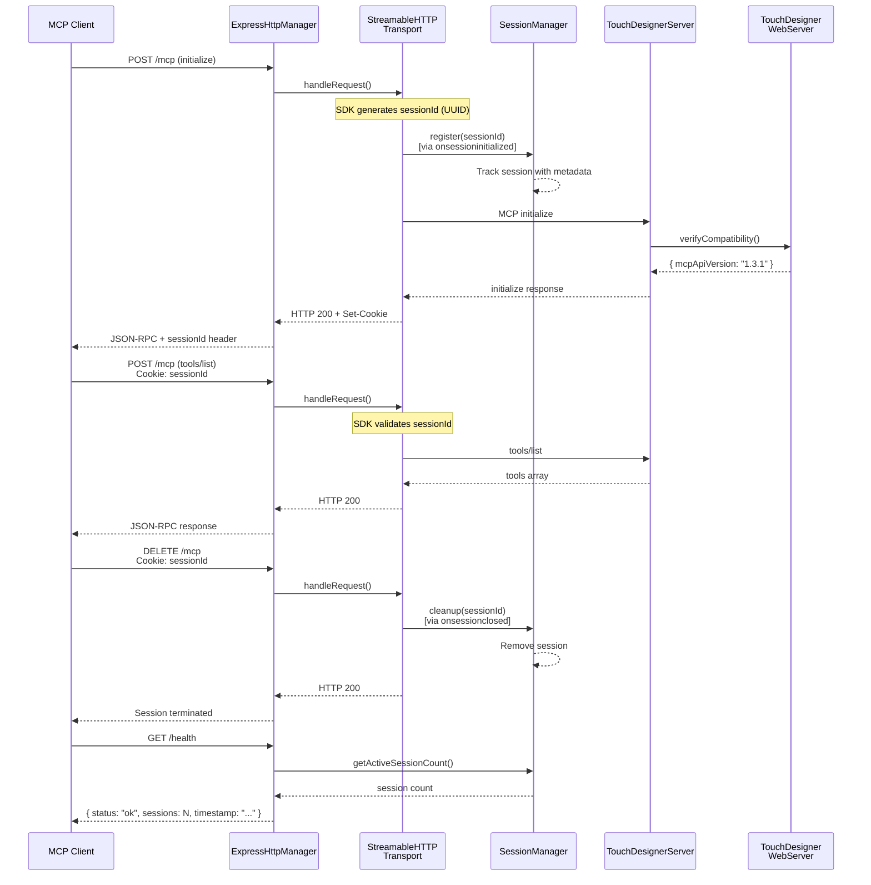

# TouchDesigner MCP Server Architecture

This document describes the architecture of the TouchDesigner MCP server.

## Table of Contents

1. [Overview](#overview)
2. [System Architecture](#system-architecture)
3. [Transport Layer](#transport-layer)
4. [Core Layer](#core-layer)
5. [TouchDesigner Integration Layer](#touchdesigner-integration-layer)
6. [Data Flow](#data-flow)
7. [Transport Selection Guide](#transport-selection-guide)
8. [Design Principles](#design-principles)

---

## Overview

The TouchDesigner MCP Server is an MCP (Model Context Protocol) implementation that connects AI agents (Claude, Codex, etc.) with TouchDesigner projects.

### Key Features

- **Dual-Process Architecture**: Composed of two processes: Node.js MCP server and TouchDesigner Python WebServer
- **Multiple Transport Support**: Supports Stdio (standard I/O) and Streamable HTTP (HTTP + SSE)
- **SDK-First Approach**: Maximizes use of MCP SDK built-in features while minimizing custom code
- **Type Safety**: Strict type checking and runtime validation using TypeScript and Zod

---

## System Architecture

### High-Level Architecture

```mermaid
flowchart TB
    subgraph Client ["AI Agent Layer"]
        A1["🤖 Claude"]
        A2["🤖 Codex"]
        A3["🤖 Other MCP Clients"]
    end

    subgraph Transport ["Transport Layer<br/>(Node.js)"]
        B1["📡 TransportFactory<br/>(src/transport/factory.ts)"]
        B2["📞 StdioServerTransport<br/>(MCP SDK)"]
        B3["🌐 StreamableHTTPServerTransport<br/>(MCP SDK)"]
        B4["🖥️ ExpressHttpManager<br/>(src/transport/expressHttpManager.ts)"]
        B5["🔐 SessionManager<br/>(src/transport/sessionManager.ts)"]
    end

    subgraph Core ["Core Layer<br/>(Node.js)"]
        C1["🎯 TouchDesignerServer<br/>(src/server/touchDesignerServer.ts)"]
        C2["🔌 ConnectionManager<br/>(src/server/connectionManager.ts)"]
        C3["🧰 Tool Handlers<br/>(src/features/tools/handlers)"]
        C4["🌐 TouchDesignerClient<br/>(src/tdClient)"]
    end

    subgraph TD ["TouchDesigner Integration Layer<br/>(Python)"]
        D1["🧩 WebServer DAT<br/>(mcp_webserver_base.tox)"]
        D2["🎛️ API Controller<br/>(api_controller.py)"]
        D3["⚙️ API Service<br/>(api_service.py)"]
        D4["🎨 TouchDesigner Nodes<br/>(/project1/...)"]
    end

    A1 & A2 & A3 --> B1
    B1 --> B2 & B3
    B3 --> B4
    B4 --> B5
    B2 & B3 --> C1
    C1 --> C2
    C2 --> C3
    C3 --> C4
    C4 <--> D1
    D1 <--> D2
    D2 <--> D3
    D3 <--> D4

    classDef client fill:#d8e8ff,stroke:#1f6feb,stroke-width:2px
    classDef transport fill:#fff3cd,stroke:#ffc107,stroke-width:2px
    classDef core fill:#efe1ff,stroke:#8250df,stroke-width:2px
    classDef td fill:#d7f5e3,stroke:#2f9e44,stroke-width:2px

    class A1,A2,A3 client
    class B1,B2,B3,B4,B5 transport
    class C1,C2,C3,C4 core
    class D1,D2,D3,D4 td
```



#### Connection Modes

**Stdio Mode**

```mermaid
flowchart LR
    A["🤖 AI Agent CLI"]

    subgraph Node ["Node.js MCP Server"]
        T1["📞 StdioServerTransport"]
        S1["🎯 TouchDesignerServer"]
    end

    subgraph TD ["TouchDesigner"]
        W1["🧩 WebServer DAT"]
        P1["🎨 TouchDesigner Nodes"]
    end

    A -->|"stdin/stdout"| T1 --> S1 --> W1 --> P1

    classDef node fill:#fff3cd,stroke:#ffc107,stroke-width:2px
    classDef core fill:#efe1ff,stroke:#8250df,stroke-width:2px
    classDef td fill:#d7f5e3,stroke:#2f9e44,stroke-width:2px

    class T1 node
    class S1 core
    class W1,P1 td
```



**Streamable HTTP Mode**

```mermaid
flowchart LR
    C["🤖 AI Agent / Browser"]
    subgraph HTTP ["HTTP Edge"]
        H1["🌐 Streamable HTTP<br/>Server Transport"]
        H2["🖥️ ExpressHttpManager"]
        H3["🔐 SessionManager"]
    end

    subgraph NodeCore ["Node.js Core"]
        S2["🎯 TouchDesignerServer"]
    end

    subgraph TouchDesigner ["TouchDesigner"]
        W2["🧩 WebServer DAT"]
        P2["🎨 TouchDesigner Nodes"]
    end

    C -->|"HTTPS + SSE"| H1 --> H2 --> H3 --> S2 --> W2 --> P2

    classDef transport fill:#fff3cd,stroke:#ffc107,stroke-width:2px
    classDef core fill:#efe1ff,stroke:#8250df,stroke-width:2px
    classDef td fill:#d7f5e3,stroke:#2f9e44,stroke-width:2px

    class H1,H2,H3 transport
    class S2 core
    class W2,P2 td
```



### Architecture Layers

1. **AI Agent Layer**: MCP clients (Claude, Codex, etc.)
2. **Transport Layer**: Handles MCP protocol communication (Stdio/HTTP)
3. **Core Layer**: MCP server business logic and TouchDesigner client
4. **TouchDesigner Integration Layer**: Python WebServer and node operations within TouchDesigner

---

## Transport Layer

The transport layer provides a pluggable architecture that supports multiple MCP transport protocols.

### Component Structure


### TransportFactory

**Responsibility**: Generate transport instances based on configuration

**Implementation**: [src/transport/factory.ts](../src/transport/factory.ts)

```typescript
class TransportFactory {
  static create(
    config: TransportConfig,
    logger?: ILogger,
    sessionManager?: ISessionManager | null
  ): Result<Transport, Error>
}
```

**Key Features**:

- **Logger Integration**: Session lifecycle events logged via ILogger
- **SessionManager Integration**: SDK callbacks wired to SessionManager methods
  - `onsessioninitialized` → `sessionManager.register(sessionId)`
  - `onsessionclosed` → `sessionManager.cleanup(sessionId)`

**Supported Transports**:

1. **Stdio**: Standard I/O based transport (default)
   - For local CLI usage
   - No session management required
   - Single connection
   - Logger and SessionManager parameters ignored

2. **Streamable HTTP**: HTTP + SSE based transport
   - For remote clients/web applications
   - Full session management support via SDK callbacks
   - Multiple concurrent sessions support
   - Logger and SessionManager parameters utilized

### ExpressHttpManager

**Responsibility**: HTTP server lifecycle management

**Implementation**: [src/transport/expressHttpManager.ts](../src/transport/expressHttpManager.ts)

**Key Features**:

- Express app generation using SDK's `createMcpExpressApp()`
- `/mcp` endpoint: Delegates to `transport.handleRequest()`
- `/health` endpoint: Health check (includes active session count)
- Graceful shutdown

**Endpoint Configuration**:

```typescript
// MCP protocol endpoints
app.post('/mcp', handleMcpRequest); // JSON-RPC requests
app.get('/mcp', handleMcpRequest);  // SSE streaming
app.delete('/mcp', handleMcpRequest); // Session termination

// Health check
app.get('/health', (req, res) => {
  res.json({
    status: 'ok',
    sessions: sessionManager.getActiveSessionCount(),
    timestamp: new Date().toISOString()
  });
});
```

### SessionManager

**Responsibility**: Client session management

**Implementation**: [src/transport/sessionManager.ts](../src/transport/sessionManager.ts)

**Key Features**:

- Session registration (SDK-generated UUIDs)
- Session cleanup
- TTL-based automatic expiration with error handling
- Active session tracking

**SDK Integration**:

Session lifecycle is fully integrated with MCP SDK callbacks:

- **Session Creation**: SDK generates session IDs via `onsessioninitialized` callback
- **Session Registration**: `SessionManager.register()` tracks SDK-created sessions
- **Session Validation**: Handled by SDK (`StreamableHTTPServerTransport.handleRequest()`)
- **Session Cleanup**: `SessionManager.cleanup()` called from `onsessionclosed` callback
- **Automatic Expiration**: TTL-based cleanup runs independently

```typescript
interface ISessionManager {
  create(metadata?: Record<string, unknown>): string;  // Manual creation (not used with SDK)
  register(sessionId: string, metadata?: Record<string, unknown>): void;  // SDK integration
  cleanup(sessionId: string): Result<void, Error>;
  list(): Session[];
  startTTLCleanup(): void;
  stopTTLCleanup(): void;
  getActiveSessionCount(): number;
}
```

---

## Core Layer

The core layer handles MCP server business logic and communication with TouchDesigner WebServer.

### TouchDesignerServer

**Responsibility**: Main entry point for MCP server

**Implementation**: [src/server/touchDesignerServer.ts](../src/server/touchDesignerServer.ts)

**Key Features**:

- Transport connection management
- Registration of MCP tools, prompts, and resources
- TouchDesigner compatibility verification

```typescript
class TouchDesignerServer {
  async connect(transport: Transport): Promise<Result<void, Error>>
  async disconnect(): Promise<Result<void, Error>>
  getTransportInfo(): TransportInfo
}
```

### ConnectionManager

**Responsibility**: Transport connection lifecycle management

**Implementation**: [src/server/connectionManager.ts](../src/server/connectionManager.ts)

**Key Features**:

- Transport-agnostic connection management
- Connection metadata tracking
- Transport type detection

```typescript
class ConnectionManager {
  async connect(transport: Transport): Promise<Result<void, Error>>
  async disconnect(): Promise<Result<void, Error>>
  getTransportType(): TransportType | null
  getConnectionMetadata(): ConnectionMetadata
  isConnected(): boolean
}
```

### Tool Handlers

**Implementation**: [src/features/tools/handlers/tdTools.ts](../src/features/tools/handlers/tdTools.ts)

MCP tool implementations categorized as follows:

1. **Node Operations**:
   - `create_td_node`: Create node
   - `delete_td_node`: Delete node
   - `get_td_nodes`: Get node list

2. **Parameter Operations**:
   - `get_td_node_parameters`: Get parameters
   - `update_td_node_parameters`: Update parameters

3. **Python Execution**:
   - `execute_python_script`: Execute Python script

4. **Class/Module**:
   - `get_td_classes`: Get TouchDesigner class list
   - `get_td_class_details`: Get class details
   - `get_td_module_help`: Get module help

### TouchDesignerClient

**Implementation**: [src/tdClient/](../src/tdClient/)

**Responsibility**: HTTP communication with TouchDesigner WebServer

- Auto-generated from OpenAPI schema
- Type safety with Zod schemas
- Connection pooling

---

## TouchDesigner Integration Layer

The TouchDesigner integration layer handles Python WebServer and node operations within TouchDesigner.

### WebServer DAT Component

**File**: [td/mcp_webserver_base.tox](../td/mcp_webserver_base.tox)

**Responsibility**: Provide HTTP API endpoints

**Key Features**:

- HTTP API endpoints based on OpenAPI specification
- JSON-RPC style request/response
- Error handling and logging

### Python Controllers & Services

**Implementation**: [td/modules/mcp/](../td/modules/mcp/)

**Key Components**:

1. **api_controller.py**: HTTP request routing
2. **api_service.py**: Business logic for TouchDesigner operations
3. **generated_handlers.py**: Auto-generated handler stubs

**Node Operation Example**:

```python
# Node creation
def create_node(parent_path: str, node_type: str, node_name: str = None):
    parent = op(parent_path)
    node = parent.create(node_type, node_name)
    return {
        'path': node.path,
        'type': node.type,
        'name': node.name
    }
```

---

## Data Flow

### Stdio Transport Flow


### HTTP Transport Flow



### Session Lifecycle


---

## Transport Selection Guide

### Overview

The TouchDesigner MCP Server supports two transport modes, each optimized for different use cases. Both modes provide identical functionality through the same `TouchDesignerServer` implementation—the only difference is the communication protocol.

### Transport Comparison

| Feature | Stdio Mode | HTTP Mode |
| --- | --- | --- |
| **Connection** | Standard I/O (stdin/stdout) | HTTP/SSE (Server-Sent Events) |
| **Use Case** | Local CLI tools, desktop applications | Remote agents, web applications, microservices |
| **Session Management** | Single connection | Multi-session with TTL expiration |
| **Concurrency** | 1 process = 1 connection | Multiple concurrent sessions |
| **Remote Access** | Not supported | Supported (network accessible) |
| **Health Check** | Not available | `GET /health` endpoint |
| **Monitoring** | Limited | Session tracking, metrics |
| **Debugging** | Requires MCP Inspector | Standard HTTP tools (curl, Postman, browser DevTools) |
| **Scalability** | Limited (1:1 process model) | High (load balancing, horizontal scaling) |
| **Security** | Process isolation | DNS rebinding protection, session validation |
| **Deployment** | Simple (local binary) | Requires HTTP server setup |

### When to Use Stdio Mode

**Best For**:

- Local development and testing
- Claude Desktop integration
- Single-user desktop applications
- Development environments where simplicity is prioritized
- Scenarios requiring strict process isolation

**Example Use Cases**:

1. **Claude Desktop Integration**

   ```json
   {
     "mcpServers": {
       "touchdesigner": {
         "command": "npx",
         "args": ["-y", "touchdesigner-mcp-server@latest", "--stdio"]
       }
     }
   }
   ```

2. **Local Development**

   ```bash
   # Direct MCP server execution
   npx touchdesigner-mcp-server --stdio

   # With MCP Inspector for debugging
   npx @modelcontextprotocol/inspector node dist/cli.js --stdio
   ```

3. **Docker Integration** (Local)

   ```json
   {
     "mcpServers": {
       "touchdesigner": {
         "command": "docker",
         "args": [
           "compose", "-f", "/path/to/docker-compose.yml",
           "exec", "-i", "touchdesigner-mcp-server",
           "node", "dist/cli.js", "--stdio",
           "--host=http://host.docker.internal"
         ]
       }
     }
   }
   ```

**Advantages**:

- Simple setup (no port configuration)
- Strong process isolation
- No network exposure
- Minimal attack surface
- Works with standard POSIX tools

**Limitations**:

- Cannot accept remote connections
- Limited to single client
- No built-in health checking
- Harder to debug (requires specialized tools)

### When to Use HTTP Mode

**Best For**:

- Production deployments
- Web application integrations
- Remote access scenarios
- Multiple concurrent clients
- Monitoring and observability requirements
- Scalable architectures

**Example Use Cases**:

1. **Production Server**

   ```bash
   # Start HTTP server
   touchdesigner-mcp-server \
     --mcp-http-port=3000 \
     --mcp-http-host=127.0.0.1 \
     --host=http://127.0.0.1 \
     --port=9981

   # Health check
   curl http://localhost:3000/health
   # Response: {"status":"ok","sessions":0,"timestamp":"2025-12-06T..."}
   ```

2. **Web Browser Integration**

   ```javascript
   // Browser-based MCP client
   const eventSource = new EventSource('http://localhost:3000/mcp');

   eventSource.onmessage = (event) => {
     const response = JSON.parse(event.data);
     console.log('TouchDesigner response:', response);
   };

   // Send JSON-RPC request
   fetch('http://localhost:3000/mcp', {
     method: 'POST',
     headers: { 'Content-Type': 'application/json' },
     body: JSON.stringify({
       jsonrpc: '2.0',
       method: 'tools/call',
       params: {
         name: 'get_td_nodes',
         arguments: { parentPath: '/project1' }
       }
     })
   });
   ```

3. **Multi-Client Architecture**

   ```bash
   # Multiple AI agents can connect simultaneously
   # Client 1: Claude Desktop (via HTTP client library)
   # Client 2: Web application
   # Client 3: VSCode extension
   # All sharing the same MCP server instance
   ```

4. **Monitoring Integration**

   ```bash
   # Prometheus metrics scraping
   curl http://localhost:3000/health

   # Load balancer health check
   # Configure ALB/NLB to check /health endpoint
   ```

**Advantages**:

- Remote access capability
- Multiple concurrent sessions
- Standard HTTP debugging tools
- Built-in health checking
- Session management with TTL
- Horizontal scalability
- Load balancing support
- Easy monitoring integration

**Limitations**:

- Requires port configuration
- Network security considerations
- More complex setup
- Requires session management

### Usage Examples

#### Stdio Mode Configuration

**Claude Desktop** (`~/.config/claude-desktop/config.json`):

```json
{
  "mcpServers": {
    "touchdesigner": {
      "command": "npx",
      "args": [
        "-y",
        "touchdesigner-mcp-server@latest",
        "--stdio",
        "--host=http://127.0.0.1",
        "--port=9981"
      ]
    }
  }
}
```

**Docker Compose**:

```yaml
services:
  touchdesigner-mcp-server:
    image: touchdesigner-mcp-server
    extra_hosts:
      - "host.docker.internal:host-gateway"
    stdin_open: true
    tty: true
    command: ["tail", "-f", "/dev/null"]  # Keep container running
```

**Usage**:

```bash
docker-compose up -d
# Connect via docker compose exec
docker compose exec -i touchdesigner-mcp-server \
  node dist/cli.js --stdio --host=http://host.docker.internal
```

#### HTTP Mode Configuration

**Direct Execution**:

```bash
touchdesigner-mcp-server \
  --mcp-http-port=3000 \
  --mcp-http-host=127.0.0.1 \
  --host=http://127.0.0.1 \
  --port=9981
```

**Docker Compose** (Future Support):

```yaml
services:
  touchdesigner-mcp-server:
    image: touchdesigner-mcp-server
    extra_hosts:
      - "host.docker.internal:host-gateway"
    ports:
      - "3000:3000"
    environment:
      - MCP_HTTP_PORT=3000
      - MCP_HTTP_HOST=0.0.0.0
      - TD_HOST=http://host.docker.internal
      - TD_PORT=9981
    command: [
      "node", "dist/cli.js",
      "--mcp-http-port=3000",
      "--mcp-http-host=0.0.0.0",
      "--host=http://host.docker.internal",
      "--port=9981"
    ]
```

**With Load Balancer**:

```yaml
services:
  nginx:
    image: nginx
    ports:
      - "80:80"
    volumes:
      - ./nginx.conf:/etc/nginx/nginx.conf
    depends_on:
      - mcp-server-1
      - mcp-server-2

  mcp-server-1:
    image: touchdesigner-mcp-server
    command: ["node", "dist/cli.js", "--mcp-http-port=3000"]

  mcp-server-2:
    image: touchdesigner-mcp-server
    command: ["node", "dist/cli.js", "--mcp-http-port=3000"]
```

### Common Configuration Options

Both modes support these TouchDesigner connection options:

| Option | Description | Default | Example |
| --- | --- | --- | --- |
| `--host` | TouchDesigner WebServer host | `http://127.0.0.1` | `--host=http://192.168.1.100` |
| `--port` | TouchDesigner WebServer port | `9981` | `--port=9982` |

**HTTP Mode Additional Options**:

| Option | Description | Default | Required |
| --- | --- | --- | --- |
| `--mcp-http-port` | MCP HTTP server port | - | Yes (for HTTP mode) |
| `--mcp-http-host` | MCP HTTP bind address | `127.0.0.1` | No |

### Migration Guide

#### From Stdio to HTTP

**Before** (Stdio):

```bash
npx touchdesigner-mcp-server --stdio
```

**After** (HTTP):

```bash
npx touchdesigner-mcp-server \
  --mcp-http-port=3000 \
  --mcp-http-host=127.0.0.1
```

**Client Code Changes**:

```javascript
// Before: Stdio (via child_process)
const { spawn } = require('child_process');
const server = spawn('npx', ['touchdesigner-mcp-server', '--stdio']);

// After: HTTP (via fetch/EventSource)
const response = await fetch('http://localhost:3000/mcp', {
  method: 'POST',
  headers: { 'Content-Type': 'application/json' },
  body: JSON.stringify({ /* MCP request */ })
});
```

#### From HTTP to Stdio

**Before** (HTTP):

```bash
touchdesigner-mcp-server --mcp-http-port=3000
```

**After** (Stdio):

```bash
touchdesigner-mcp-server --stdio
```

**Note**: Session management features (TTL, health checks, concurrent sessions) are not available in Stdio mode.

---

## Design Principles

### 1. Clean Architecture

Follows layer separation and dependency inversion principles:

- **Transport Layer**: Protocol handling only
- **Core Layer**: Business logic
- **Integration Layer**: Connection with external systems (TouchDesigner)

### 2. SDK-First Approach

Maximizes use of MCP SDK built-in features:

- Minimize custom code
- Rely on standard implementations
- Automatically benefit from SDK updates

### 3. Type Safety

Strict type safety with TypeScript and Zod:

- Compile-time type checking
- Runtime validation
- Centralized type definitions and schemas

### 4. Result Pattern

Consistent error handling:

```typescript
type Result<T, E = Error> =
  | { success: true; data: T }
  | { success: false; error: E };
```

### 5. Interface-Driven Design

Interface-driven design for testability and extensibility:

```typescript
interface ISessionManager {
  create(metadata?: Record<string, unknown>): string;
  cleanup(sessionId: string): Result<void, Error>;
  // ...
}

interface ILogger {
  sendLog(params: { level: string; data: string; logger: string }): void;
}
```

### 6. OpenAPI-Based Code Generation

Code generation from OpenAPI schema:

- **Schema-First**: [src/api/index.yml](../src/api/index.yml)
- **Python Server**: Generated with `openapi-generator-cli`
- **TypeScript Client**: Generated with Orval
- **Zod Schemas**: Generated with Orval

Generation Process:

```bash
npm run gen:webserver  # Python server generation
npm run gen:handlers   # Python handlers generation
npm run gen:mcp        # TypeScript client + Zod schemas
npm run gen            # Run all generation steps
```

---

## Extensibility

### Adding New Transports

1. Define configuration type in `src/transport/config.ts`
2. Add Zod schema
3. Add new case to `TransportFactory.create()`
4. Implement transport-specific manager (if needed)

**Example (WebSocket)**:

```typescript
// 1. Define config
export interface WebSocketTransportConfig {
  type: 'websocket';
  port: number;
  path?: string;
}

// 2. Add to union type
export type TransportConfig =
  | StdioTransportConfig
  | StreamableHttpTransportConfig
  | WebSocketTransportConfig;

// 3. Extend factory
static create(config: TransportConfig): Result<Transport, Error> {
  switch (config.type) {
    case 'stdio':
      return this.createStdio();
    case 'streamable-http':
      return this.createStreamableHttp(config);
    case 'websocket':
      return this.createWebSocket(config);
  }
}
```

### Adding New MCP Tools

1. Add endpoint definition to OpenAPI schema
2. Generate code with `npm run gen`
3. Implement business logic in Python service
4. Implement TypeScript tool handler

---

## References

### MCP Specification

- [MCP Specification - Transports](https://modelcontextprotocol.io/specification/2025-03-26/basic/transports)
- [Streamable HTTP Transport](https://modelcontextprotocol.io/specification/2025-03-26/basic/transports#http-with-sse)

### MCP TypeScript SDK

- [SDK Repository](https://github.com/modelcontextprotocol/typescript-sdk)
- [Express Integration](https://github.com/modelcontextprotocol/typescript-sdk/blob/main/src/server/express.ts)

---

**Document Version**: 1.0
**Last Updated**: 2025-12-06
**Status**: Complete
