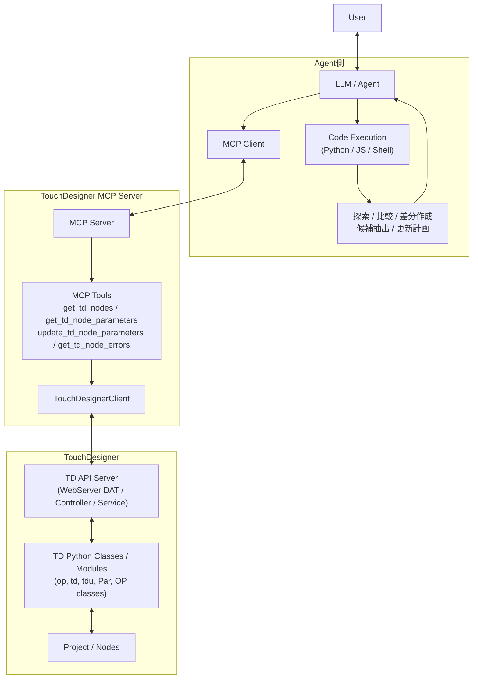
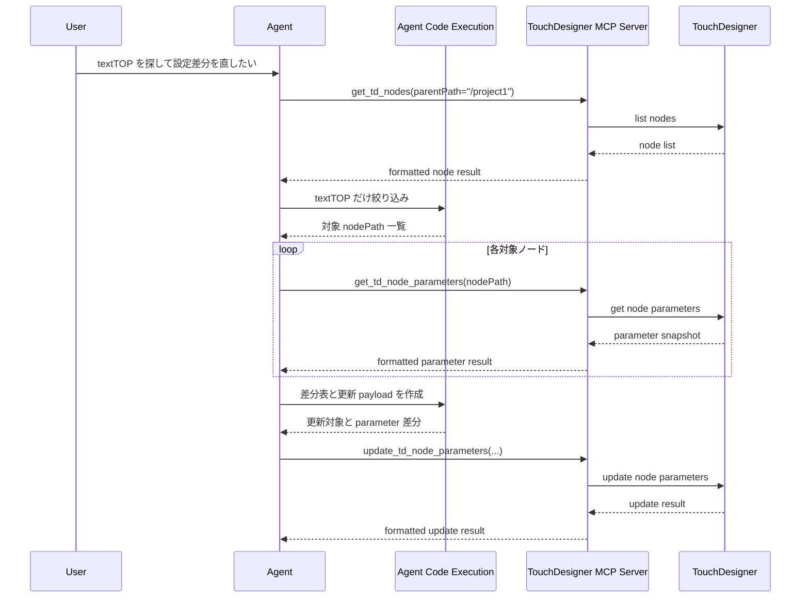

# Code Execution 設計メモ

## 概要

この文書は、TouchDesigner MCP における `code execution` の位置づけを明文化するための設計メモです。
`docs/code_execution.md` は補助図として残し、本書ではその背景、現行設計との関係、今後の拡張方針を整理します。

本書でいう `code execution` は、TouchDesigner 内で任意 Python を実行することそのものではありません。
主眼は、**Agent 側が MCP ツールの返り値をコードで加工し、次に行う最小限の操作を決める実行層** をどう位置づけるかにあります。

## 背景と目的

`MCP is dead` という議論は、MCP の存在自体よりも、次の設計を批判していることが多いです。

- ツールを細かく並べるだけで、結果の集計や比較をすべて会話コンテキストに押し込む設計
- 既存 CLI で十分な領域でも、MCP を過剰な抽象化として重ねる設計
- モデルの内部推論に依存しすぎて、再現性やデバッグ性が下がる設計

一方、このプロジェクトは既存 CLI の焼き直しではなく、TouchDesigner の WebServer DAT と Python API を AI エージェントへ橋渡しする役割を持ちます。
そのため、MCP 自体を捨てるのではなく、**MCP を安全な操作プリミティブとして維持しつつ、Agent 側 code execution を前提に責務を再整理する** のが妥当です。

この文書の目的は次の 3 点です。

- このプロジェクトでの `code execution` の定義を固定する
- 現行設計がすでに担っている責務と、今後 Agent 側へ寄せる責務を分けて説明する
- 将来の実装方針を、段階的に導入できる形で整理する

## このプロジェクトにおける `code execution` の定義

このプロジェクトでは `code execution` を次の 2 つに分けて扱います。

| 用語 | 定義 | このプロジェクトでの役割 |
| --- | --- | --- |
| Agent 側 code execution | Agent が Python / JavaScript / shell などを実行し、MCP ツールの返り値を加工すること | 推奨される主役。探索、比較、差分作成、候補抽出を担当する |
| TouchDesigner 側 code execution | `execute_python_script` を使って TouchDesigner 内で任意 Python を実行すること | 逃げ道。プリミティブな MCP ツールで表現しにくい操作に限定する |

したがって、本書で `code execution` と書く場合は、明示しない限り **Agent 側 code execution** を指します。

## 現行設計の整理

現行設計は、すでに「MCP ツールを呼び、その返り値を見て次の操作を決める」という流れで動いています。
ただし、その比較や抽出の多くは Agent の会話コンテキスト内で暗黙に行われています。

### 現在の責務分担

- MCP ツールは TouchDesigner への問い合わせを行い、`detailLevel` や `responseFormat` に応じて表示向けの整形を行う
  例: [src/features/tools/handlers/tdTools.ts](../src/features/tools/handlers/tdTools.ts)
- ツール返り値は主に `content[].text` で返される
  例: [src/features/tools/handlers/tdTools.ts](../src/features/tools/handlers/tdTools.ts)
- `TouchDesignerClient` は生成済み API クライアントを束ね、TouchDesigner API 呼び出しと互換性管理を担当する
  例: [src/tdClient/touchDesignerClient.ts](../src/tdClient/touchDesignerClient.ts)
- TouchDesigner 側では WebServer DAT / Controller / Service が API を受け、TD Python Classes / Modules を通して Project / Nodes を読む・更新する

### 現行設計の特徴

- `detailLevel` は Agent のコンテキスト消費を抑えるための最適化として機能している
- `responseFormat` は JSON / YAML / Markdown を選べるが、返却モデルの主軸は依然として text である
- 結果のフィルタ、比較、差分作成、候補抽出は、ツールではなく Agent 側の文脈理解に大きく依存している
- そのため、処理フロー自体はすでに code execution 的だが、計算が明示的なコードとして外出しされていない

## Before / After

現行設計と、Agent 側 code execution を前提にした設計との差は、できることの種類より **責務の配置** にあります。

| 比較軸 | Before: 現行設計 | After: 推奨設計 |
| --- | --- | --- |
| 責務配置 | ツールが表示向け整形を担い、比較や抽出は主に LLM 文脈依存 | MCP は安全な操作プリミティブを返し、探索や比較は Agent 側 code execution が担う |
| コンテキスト消費 | 長い一覧や差分を会話コンテキストで扱いやすい | 中間計算をコードに逃がし、会話には要約だけ戻せる |
| 再現性 | 同じ判断を再現しにくい | 絞り込みや比較がコードとして再実行できる |
| デバッグ性 | なぜその判断になったか追いにくい | 中間計算や選択条件をログ・コードとして追いやすい |
| 大規模プロジェクト耐性 | ノード数や差分量が増えると文脈処理が重くなる | 大きい結果でも集計・比較を局所化しやすい |

## 推奨アーキテクチャ

推奨構成は、`Agent側`、`TouchDesigner MCP Server`、`TouchDesigner` の 3 層です。
ポイントは、MCP をやめることではなく、**MCP を小さく安全な部品にし、その上に Agent 側の計算層を明示的に置くこと** です。

### レイヤーごとの責務

- Agent 側
  MCP の返り値を読んで、絞り込み、比較、差分計算、更新計画作成をコードで実行する
- TouchDesigner MCP Server 側
  TouchDesigner を操作するための安全で小さい操作単位を提供する
- TouchDesigner 側
  API を受け取り、TD Python Classes / Modules を通じて Project / Nodes を操作する

## 代表フロー

代表例は「ノード一覧から対象を絞り、差分を見つけて、必要なノードだけ更新する」流れです。

このフローでは、MCP が実際の読み書きを行い、code execution は「どれを読むか」「何を更新するか」を決めています。

## 具体ユースケース

### 1. ノード探索と絞り込み

例: `/project1` 配下から `textTOP` だけを探し、候補を family や path で整理したい。

MCP がすること:

- `get_td_nodes` でノード一覧を取得する
- 必要に応じて `get_td_node_parameters` で詳細を補う

code execution がすること:

- `textTOP` や特定 family のノードだけ抽出する
- path、親子関係、命名規則でグルーピングする
- 次に詳細取得すべきノードだけを選ぶ

### 2. パラメータ差分の検出と一括更新

例: 複数の textTOP でフォント、解像度、blend 設定を揃えたい。

MCP がすること:

- `get_td_node_parameters` で各ノードの現在値を取得する
- `update_td_node_parameters` で必要なノードだけ更新する

code execution がすること:

- 各ノードのパラメータを比較し、差分表を作る
- どの値を正とするか決め、更新 payload を生成する
- 更新対象を最小限に絞る

### 3. エラー集計と原因候補抽出

例: 複数ノードにエラーが出ているときに、共通原因を探したい。

MCP がすること:

- `get_td_node_errors` でエラー一覧を取得する
- 必要に応じて `get_td_node_parameters` や `get_td_nodes` で周辺情報を補う

code execution がすること:

- エラーを path 単位、親コンテナ単位、メッセージ種別で集計する
- 共通 upstream ノードや命名パターンを仮説として抽出する
- 次に確認すべきノード群を優先順位付きで返す

## `execute_python_script` の位置づけ

`execute_python_script` は重要な機能ですが、推奨フローの主軸ではありません。
この設計では、次のように位置づけます。

- 通常フロー
  `get_td_nodes`、`get_td_node_parameters`、`update_td_node_parameters`、`get_td_node_errors` などの構造化されたツールを優先する
- 例外フロー
  構造化ツールで表現しづらい操作だけ `execute_python_script` を使う

言い換えると、`execute_python_script` は **escape hatch** です。
TouchDesigner 側 code execution を中心に据えるのではなく、Agent 側 code execution と構造化ツールを主役に据えるべきです。

## 将来の設計方針

この文書は実装ではなく設計判断をまとめるものです。以下は将来の実装候補です。

### 1. `structuredContent` / `outputSchema` の導入

- 現在の text 中心返却を保ちつつ、一部ツールから機械処理しやすい構造化レスポンスを返せるようにする
- Agent 側 code execution が、テキスト解析ではなく構造化データ処理で比較や差分作成を行えるようにする

### 2. Resources の追加

- project tree、node snapshot、error snapshot、class catalog などを resource 化する
- 「読む」用途を tools から分離し、状態参照を安定化させる

### 3. task-oriented tool の追加

- `connect_td_nodes`、`find_td_nodes_fuzzy`、`snapshot_td_graph` のような、利用頻度の高い操作をワークフローツールとして追加する
- 低レベル primitive を残しつつ、よく使う操作だけ高レベル化する

### 4. `execute_python_script` の escape hatch 化

- ドキュメント上の位置づけを明確にし、標準導線からは一段下げる
- 将来的には権限やモードの分離も検討する

## 段階的移行

### Step 1. 現状の text 中心設計を維持したまま設計意図を共有する

- まずは本設計をチーム内で共有し、`code execution` を Agent 側の計算層として定義する
- `docs/code_execution.md` は補助図、本書は判断基準として扱う

### Step 2. 一部ツールに structured response を導入する

- 参照系のツールから `structuredContent` / `outputSchema` を追加する
- 既存の text 出力は後方互換のため残す

### Step 3. resource / workflow tool を拡充する

- 状態参照を resource に寄せる
- 高頻度の作業を task-oriented tool として追加する
- `execute_python_script` は例外経路として明示する

## この設計で変わること

この設計は「MCP をやめる」提案ではありません。
変わるのは、次のどちらを主役に置くかです。

- これまで: MCP ツール + LLM 文脈内の暗黙的な比較・判断
- これから: MCP ツール + Agent 側 code execution による明示的な比較・判断

その結果、次の改善が期待できます。

- 会話コンテキストの消費を減らしやすい
- 大きなプロジェクトでも探索・比較がしやすい
- 判断根拠をコードとして再現しやすい
- テストやデバッグの対象を明確にしやすい

## 非目標

この文書では、以下は扱いません。

- 直ちに `docs/` 配下の既存文書体系を再編すること
- 既存ツールの API や schema をこの時点で変更すること
- `execute_python_script` を削除すること

現時点の成果物は、**設計意図を共有するための詳細設計書の追加** に限定します。
